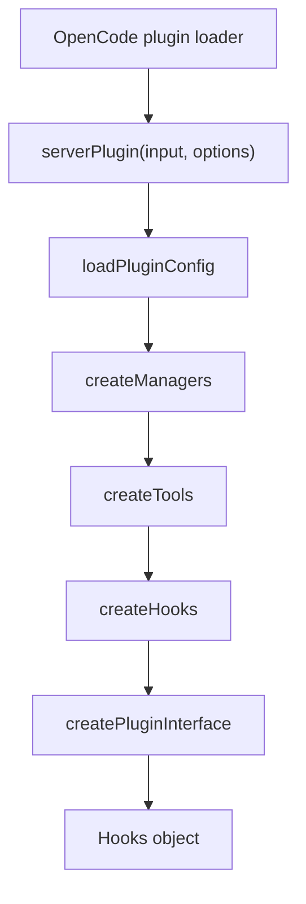

# 1장: 오마오의 전체 시스템 토폴로지

오마오는 OpenCode 안에서 실행되는 서버 플러그인이다. 그래서 토폴로지를 읽을 때 가장 먼저 버려야 할 가정은 "오마오가 자체 코어를 가진다"는 생각이다. 오마오는 OpenCode의 plugin surface를 통해 들어오고, OpenCode client와 directory를 입력으로 받아, 설정과 런타임 객체를 만든 뒤 hook handler 묶음을 반환한다.

## 왜 중요한가

플러그인은 코어보다 좁은 권한을 가진다. 하지만 좁은 권한이 곧 작은 시스템을 뜻하지는 않는다. 오마오는 OpenCode가 허용한 지점마다 정책 계층을 세운다. `config`에서는 에이전트와 MCP를 합성하고, `tool`에서는 실행 도구를 제공하며, `event`에서는 세션 생명주기를 추적한다. `experimental.chat.messages.transform`과 `experimental.session.compacting`에서는 컨텍스트와 compaction 보존에 개입한다.

## 소스 앵커

- `src/index.ts`
- `src/plugin-interface.ts`
- `src/create-managers.ts`
- `src/create-tools.ts`
- `src/create-hooks.ts`
- `src/plugin/types.ts`

## 전체 흐름



## 핵심 메커니즘

`pluginModule`은 `{ id, server }` 형태다. `id`는 여전히 `oh-my-openagent`로 남아 있고, 패키지는 `oh-my-opencode`와 `oh-my-openagent` 전환기를 함께 감당한다. 중요한 것은 이름보다 `server` 함수다. 이 함수가 플러그인 인스턴스의 단일 조립 지점이다.

초기화는 크게 다섯 단계다. 설정을 읽고, 매니저를 만들고, 도구를 만들고, 훅을 만들고, OpenCode가 호출할 handler 객체를 만든다. 이 순서는 우연이 아니다. 도구는 매니저를 필요로 하고, 훅은 설정과 모델 cache를 필요로 하며, 최종 handler는 도구와 훅을 함께 필요로 한다.

오마오의 기능 수는 많지만, 진입점은 얇다. `src/index.ts`는 business logic을 담는 파일이 아니라 lifecycle을 고정하는 파일이다. 실제 정책은 `plugin-config`, `plugin-handlers`, `hooks`, `tools`, `features`로 내려간다.

## 트레이드오프

이 구조의 장점은 OpenCode 업그레이드에 맞춰 표면별로 대응할 수 있다는 점이다. 단점은 OpenCode plugin API가 바뀌면 많은 기능이 동시에 영향을 받는다는 점이다. 그래서 오마오는 호환성 감지, 안전한 hook 생성, 설정 migration, legacy plugin toast 같은 완충 장치를 둔다.

## 핵심 코드

`src/index.ts`의 서버 플러그인 조립부다. 이 순서가 책 전체의 등뼈다.

```ts
const pluginConfig = loadPluginConfig(input.directory, input)
const tmuxConfig = createRuntimeTmuxConfig(pluginConfig)
const modelCacheState = createModelCacheState()

const managers = createManagers({
  ctx: input,
  pluginConfig,
  tmuxConfig,
  modelCacheState,
  backgroundNotificationHookEnabled: isHookEnabled("background-notification"),
})

const toolsResult = await createTools({
  ctx: input,
  pluginConfig,
  managers,
})

const hooks = createHooks({
  ctx: input,
  pluginConfig,
  modelCacheState,
  backgroundManager: managers.backgroundManager,
  modelFallbackControllerAccessor: managers.modelFallbackControllerAccessor,
  isHookEnabled,
  safeHookEnabled,
  mergedSkills: toolsResult.mergedSkills,
  availableSkills: toolsResult.availableSkills,
})

const pluginInterface = createPluginInterface({
  ctx: input,
  pluginConfig,
  firstMessageVariantGate,
  managers,
  hooks,
  tools: toolsResult.filteredTools,
})
```

## 소스 그라운딩

- `src/index.ts`의 `serverPlugin`은 `initConfigContext("opencode", null)`로 CLI/config context를 먼저 고정한다.
- 같은 함수에서 `injectServerAuthIntoClient(input.client)`를 호출해 OpenCode client 인증 표면을 플러그인 쪽에서 보강한다.
- `createModelCacheState()`는 provider context limit과 vision capability cache를 담는 공유 상태다. 이후 provider config handler와 hook들이 이 cache를 참조한다.
- `createFirstMessageVariantGate()`는 `session.created`와 첫 `chat.message` 사이의 상태를 기억한다. 이 상태는 plugin interface가 아니라 entry point에서 만들어진다.
- 최종 반환 객체는 `...pluginInterface`에 `experimental.session.compacting`을 덧붙인 형태다. compaction handler만 entry point에서 특별 취급되는 이유는 context injector와 todo preserver를 순서대로 호출해야 하기 때문이다.

## 빌더에게 남는 것

플러그인 규모가 커질수록 entry point는 더 얇아져야 한다. 진입점은 순서와 의존성만 말하고, 정책은 전용 모듈로 내려보내야 한다. 플러그인 하니스의 첫 번째 설계 원칙은 "큰 기능을 작은 초기화 순서 안에 가두는 것"이다.
