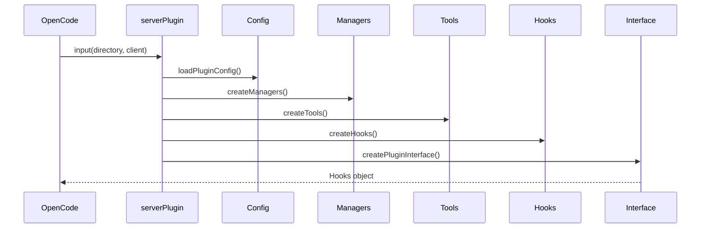

# 2장: 플러그인 엔트리포인트와 5단계 부트스트랩

오마오의 부트스트랩은 `src/index.ts`에서 시작한다. 이 파일은 기능을 직접 구현하지 않는다. 대신 OpenCode가 플러그인을 로드하는 순간 반드시 거쳐야 하는 초기화 순서를 명확하게 만든다.

## 왜 중요한가

플러그인 초기화는 실패 비용이 크다. 너무 늦게 실패하면 사용자는 채팅 도중 이상한 상태를 만난다. 너무 일찍 외부 API를 부르면 OpenCode 초기화와 교착될 수 있다. 오마오는 이 압력을 알고 있다. 예를 들어 agent config 생성 중 OpenCode client API를 호출하지 않도록 주석과 구조로 제한한다.

## 소스 앵커

- `src/index.ts`
- `src/plugin-config.ts`
- `src/create-runtime-tmux-config.ts`
- `src/plugin-state.ts`
- `src/shared/first-message-variant`
- `src/shared/posthog`

## 부트스트랩 흐름



## 핵심 메커니즘

첫 단계는 config context 초기화와 startup log다. 이후 외부 skill plugin 충돌 감지, server auth injection, JSONC 설정 로딩이 일어난다. telemetry처럼 실패가 치명적이면 안 되는 경로는 try/catch로 감싼다.

두 번째 단계는 runtime state다. tmux 설정, model cache state, first-message variant gate가 만들어진다. 이 객체들은 한 hook 안에 숨기지 않고 이후 단계로 전달된다.

세 번째 단계는 tool registry다. 이때 skill context와 available categories가 함께 만들어진다. 도구는 단순 정적 목록이 아니다. 설정, 비활성화 목록, task system 여부, hashline 여부, interactive bash 여부에 따라 달라진다.

네 번째 단계는 hook composition이다. core, continuation, skill 훅이 별도로 만들어지고 하나로 합쳐진다. 마지막 단계에서 이 훅들이 OpenCode handler에 연결된다.

## 실패 처리

부트스트랩에서 중요한 결정은 "어떤 실패를 치명적으로 볼 것인가"다. 설정 파싱 실패는 partial config로 낮출 수 있다. telemetry 실패는 무시한다. 반면 플러그인 인터페이스를 만들 수 없으면 플러그인은 동작할 수 없다.

## 핵심 코드

`disabled_hooks`가 모든 hook factory의 공통 gate가 되는 부분이다.

```ts
const disabledHooks = new Set(pluginConfig.disabled_hooks ?? [])

const isHookEnabled = (hookName: HookName): boolean =>
  !disabledHooks.has(hookName)

const safeHookEnabled =
  pluginConfig.experimental?.safe_hook_creation ?? true
```

compaction handler만 entry point에서 별도로 묶는 것도 중요하다.

```ts
"experimental.session.compacting": async (
  compactingInput: { sessionID: string },
  output: { context: string[] },
): Promise<void> => {
  await hooks.compactionContextInjector?.capture(compactingInput.sessionID)
  await hooks.compactionTodoPreserver?.capture(compactingInput.sessionID)
  await hooks.claudeCodeHooks?.["experimental.session.compacting"]?.(
    compactingInput,
    output,
  )
  if (hooks.compactionContextInjector) {
    output.context.push(
      hooks.compactionContextInjector.inject(compactingInput.sessionID),
    )
  }
}
```

## 소스 그라운딩

- `detectExternalSkillPlugin(input.directory)`는 외부 skill plugin이 이미 설치된 경우 warning을 출력한다. 플러그인 중복 기능을 런타임 전에 감지하는 단계다.
- `loadPluginConfig(input.directory, input)`은 user config와 project config를 합친 뒤 `disabled_hooks`를 set으로 바꾼다.
- `isHookEnabled`는 `disabledHooks.has(hookName)` 하나로 모든 hook factory에 전달된다. hook enable 정책의 단일 출발점이다.
- `createRuntimeTmuxConfig(pluginConfig)`는 tmux 설정을 runtime 형태로 바꾸고, `isTmuxIntegrationEnabled(pluginConfig)`는 interactive bash와 tmux manager 활성화 조건으로 쓰인다.
- `createTools()`가 `mergedSkills`와 `availableSkills`를 반환하고, 이 값이 곧 `createHooks()`의 skill hook 입력이 된다. 스킬은 도구 생성과 훅 생성 양쪽을 연결한다.

## 빌더에게 남는 것

초기화 함수는 반드시 순서를 설명해야 한다. 기능이 추가될 때마다 entry point에 직접 로직을 넣지 말고, "이 기능은 설정, 매니저, 도구, 훅, 인터페이스 중 어느 단계에 속하는가"를 먼저 물어야 한다.
