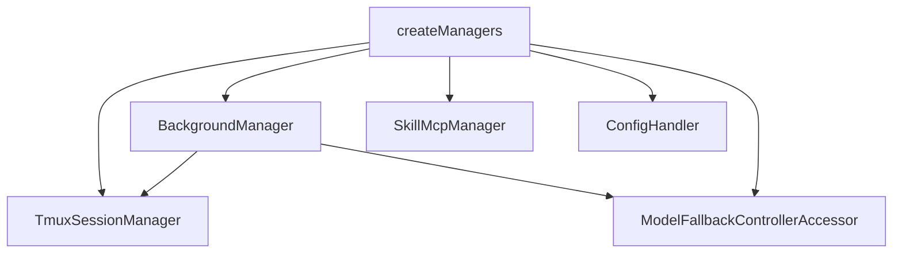

# 3장: 매니저 계층과 런타임 상태

오마오의 매니저는 플러그인 생명주기 안에서 오래 살아야 하는 상태를 맡는다. 훅 하나가 끝나도 사라지면 안 되는 정보, 하위 세션과 연결되어야 하는 정보, 프로세스 종료 시 cleanup이 필요한 정보는 매니저로 승격된다.

## 왜 중요한가

OpenCode hook handler는 이벤트 단위로 호출된다. 하지만 background agent, tmux pane, skill MCP connection, model fallback controller는 이벤트 하나보다 오래 산다. 이런 상태를 각 handler에 흩어 놓으면 복구와 종료가 어려워진다. 오마오는 이 문제를 `createManagers()`로 모은다.

## 소스 앵커

- `src/create-managers.ts`
- `src/features/background-agent/`
- `src/features/tmux-subagent/`
- `src/features/skill-mcp-manager/`
- `src/hooks/model-fallback/`
- `src/features/background-agent/process-cleanup`

## 매니저 구성



## 핵심 메커니즘

`TmuxSessionManager`는 세션 생성 이벤트와 tmux pane 추적을 연결한다. tmux 통합이 켜져 있으면 현재 프로세스를 server running 상태로 표시하고, shutdown cleanup 대상에도 등록한다.

`BackgroundManager`는 하위 에이전트 실행의 중심이다. 하위 세션이 만들어지면 tmux manager에 알리고, task toast와 parent notification 상태를 갱신한다. 즉 background agent는 단순 spawn이 아니라 세션, tmux, 알림 상태를 한꺼번에 건드리는 경계다.

`SkillMcpManager`는 skill-embedded MCP connection을 session 단위로 관리한다. tool, resource, prompt 호출은 여기서 client를 얻고 retry와 OAuth step-up을 처리한다.

`configHandler`도 매니저 결과에 들어간다. OpenCode의 `config` hook이 호출될 때마다 provider, agent, tool, MCP, command 구성을 합성해야 하므로, 설정 처리기 역시 runtime 의존성을 가진다.

## 트레이드오프

매니저 계층은 상태를 명확히 하지만, 의존성 방향을 잘못 잡으면 모든 것이 모든 것을 알게 된다. 오마오는 `createManagers`에서 연결을 한 번 맺고, 이후에는 필요한 일부 인터페이스만 넘기는 방식을 택한다.

## 핵심 코드

`src/create-managers.ts`의 반환 타입은 오마오 runtime state의 공식 목록이다.

```ts
export type Managers = {
  tmuxSessionManager: TmuxSessionManager
  backgroundManager: BackgroundManager
  skillMcpManager: SkillMcpManager
  configHandler: ReturnType<typeof createConfigHandler>
  modelFallbackControllerAccessor: ModelFallbackControllerAccessor
}
```

하위 세션 생성 callback은 background manager와 tmux manager를 연결한다.

```ts
const backgroundManager = new deps.BackgroundManagerClass(
  ctx,
  pluginConfig.background_task,
  {
    tmuxConfig,
    onSubagentSessionCreated: async (event: SubagentSessionCreatedEvent) => {
      await tmuxSessionManager.onSessionCreated({
        type: "session.created",
        properties: {
          info: {
            id: event.sessionID,
            parentID: event.parentID,
            title: event.title,
          },
        },
      })
    },
    onShutdown: async () => {
      await tmuxSessionManager.cleanup().catch((error) => {
        log("[create-managers] tmux cleanup error during shutdown:", error)
      })
    },
    enableParentSessionNotifications: backgroundNotificationHookEnabled,
  },
)
```

## 소스 그라운딩

- `createManagers()`는 `TmuxSessionManager`, `BackgroundManager`, `SkillMcpManager`, `configHandler`, `modelFallbackControllerAccessor`만 반환한다. 장기 상태의 공식 목록이다.
- tmux가 켜져 있으면 `markServerRunningInProcess()`가 먼저 호출된다. 이후 `TmuxSessionManager.cleanup()`은 process cleanup target으로 등록된다.
- `BackgroundManager` 생성자는 `onSubagentSessionCreated`, `onShutdown`, `enableParentSessionNotifications`를 받는다. 하위 세션 생성, 종료 cleanup, parent notification을 같은 manager가 조율한다.
- `initTaskToastManager(ctx.client)`는 manager 생성 단계에서 수행된다. task toast는 도구 실행 중 임시로 만드는 것이 아니라 runtime singleton으로 초기화된다.
- `SkillMcpManager`는 별도 인자 없이 생성되지만 내부 state에 `clients`, `pendingConnections`, `authProviders`, `cleanupHandlers`, `idleTimeoutMs`를 가진다.

## 빌더에게 남는 것

플러그인에서 오래 사는 상태는 훅 바깥으로 빼야 한다. 특히 하위 프로세스, 네트워크 connection, fallback 상태, 세션별 cache는 매니저가 책임져야 한다. cleanup 경로를 초기화 시점에 같이 설계하는 것도 같은 이유다.
