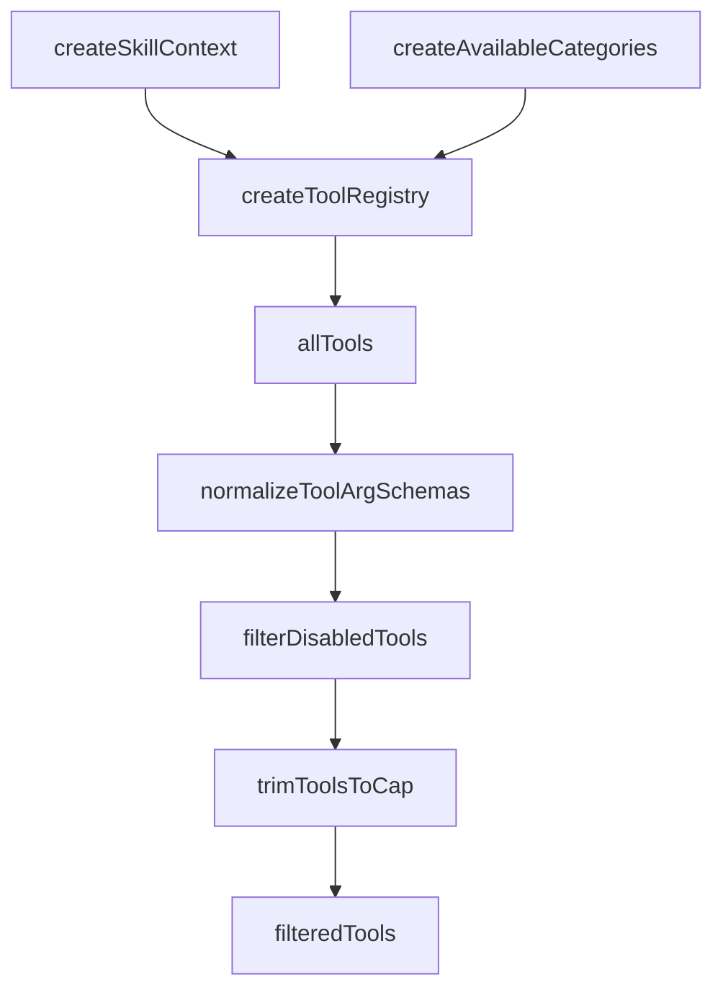

# 4장: 도구 레지스트리와 실행 표면

오마오의 tool registry는 단순히 도구를 많이 등록하는 곳이 아니다. 어떤 도구를 OpenCode에 보일지, 어떤 도구를 설정으로 끌지, 어떤 도구를 agent orchestration과 연결할지 결정하는 실행 표면이다.

## 왜 중요한가

도구는 모델 출력이 실제 행동으로 바뀌는 지점이다. 플러그인이 도구를 늘리면 능력도 늘어나지만 실패 표면도 늘어난다. 오마오는 도구를 생성할 때 config, disabled list, task system, hashline, interactive bash, skill context를 모두 반영한다.

## 소스 앵커

- `src/create-tools.ts`
- `src/plugin/tool-registry.ts`
- `src/tools/index.ts`
- `src/tools/delegate-task/`
- `src/tools/hashline-edit/`
- `src/shared/disabled-tools`

## 레지스트리 흐름



## 핵심 메커니즘

기본 도구는 LSP 계열이다. 여기에 grep, glob, ast-grep, session manager, background output/cancel, `call_omo_agent`, `look_at`, delegate task, skill, skill MCP, interactive bash, task system, hashline edit가 조건부로 합쳐진다.

`call_omo_agent`와 `task`는 단순 tool이 아니라 background manager와 agent 설정을 만난다. 모델은 도구 호출 하나로 보지만, 실제로는 하위 세션 생성, tmux 추적, category 기반 agent 선택까지 이어진다.

`normalizeToolArgSchemas`는 작은 함수처럼 보이지만 중요하다. 플러그인 도구가 OpenCode에 안정적으로 노출되려면 arg schema 형태가 일관되어야 한다. 실행 표면이 많을수록 schema 정규화는 필수다.

`disabled_tools`와 `experimental.max_tools`는 도구 수를 제어하는 운영 장치다. 특히 max tools는 low-priority order를 기준으로 제거한다. 많은 도구를 제공하되, 모델이나 provider 제약 때문에 줄여야 할 때 질서 있게 줄인다.

## 트레이드오프

도구를 한 registry에서 합성하면 전체 실행 표면을 한눈에 볼 수 있다. 반대로 registry가 커질수록 각 도구의 내부 정책까지 빨려 들어올 위험이 있다. 오마오는 factory pattern을 유지해 registry가 조립만 하도록 만든다.

## 핵심 코드

`src/plugin/tool-registry.ts`에서 실제 OpenCode에 노출되는 도구 목록이 만들어진다.

```ts
const allTools: Record<string, ToolDefinition> = {
  ...factories.builtinTools,
  ...factories.createGrepTools(ctx),
  ...factories.createGlobTools(ctx),
  ...factories.createAstGrepTools(ctx),
  ...factories.createSessionManagerTools(ctx),
  ...backgroundTools,
  call_omo_agent: callOmoAgent,
  ...(lookAt ? { look_at: lookAt } : {}),
  task: delegateTask,
  skill_mcp: skillMcpTool,
  skill: skillTool,
  ...(interactiveBashEnabled
    ? { interactive_bash: factories.interactive_bash }
    : {}),
  ...taskToolsRecord,
  ...hashlineToolsRecord,
}

for (const toolDefinition of Object.values(allTools)) {
  normalizeToolArgSchemas(toolDefinition)
}

const filteredTools: ToolsRecord =
  filterDisabledTools(allTools, pluginConfig.disabled_tools)

const maxTools = pluginConfig.experimental?.max_tools
if (maxTools) {
  trimToolsToCap(filteredTools, maxTools)
}
```

## 소스 그라운딩

- `createToolRegistry()`는 `builtinTools`, grep/glob/ast-grep/session-manager/background tools, `call_omo_agent`, `task`, `skill`, `skill_mcp`, `interactive_bash`, task system, hashline edit를 하나의 `allTools` 객체로 합친다.
- `look_at`은 `multimodal-looker`가 disabled agent 목록에 없을 때만 등록된다. agent availability가 tool surface를 바꾼다.
- `taskSystemEnabled`가 켜지면 `task_create`, `task_get`, `task_list`, `task_update`가 추가된다. 동시에 tool config handler는 native `todowrite`와 `todoread`를 끈다.
- `hashline_edit`가 켜지면 `edit` 이름에 `createHashlineEditTool(ctx)`가 들어간다. 기존 edit 이름을 바꾸지 않고 의미론을 교체하는 방식이다.
- `trimToolsToCap()`은 `LOW_PRIORITY_TOOL_ORDER`를 따라 도구를 제거한다. `experimental.max_tools`가 있을 때 provider limit을 맞추는 실제 로직이다.

## 빌더에게 남는 것

도구는 기능이 아니라 계약이다. 도구를 추가할 때는 이름, schema, 비활성화 방식, agent 노출 방식, 실패 복구 방식까지 함께 설계해야 한다. registry는 그 계약이 실제로 한곳에서 만나는 표면이어야 한다.
