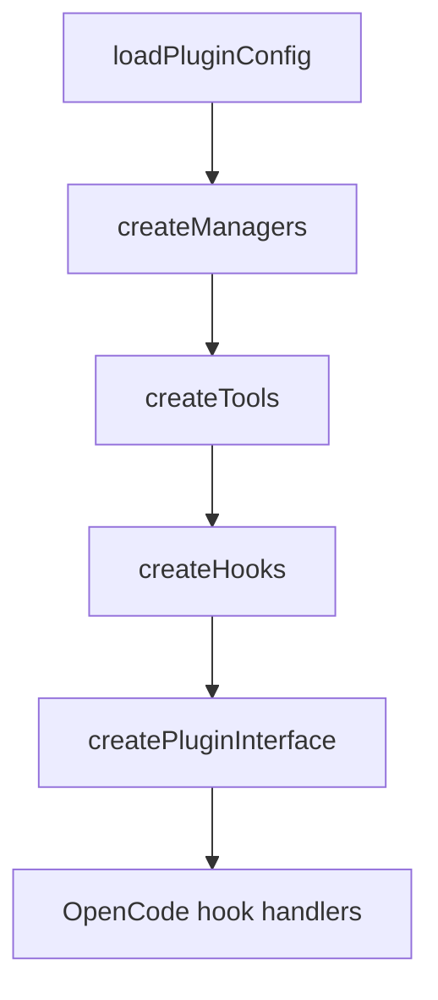

# 제1부: 플러그인은 어디에 시스템 경계를 두는가

오마오는 OpenCode 코어를 fork하지 않는다. 대신 OpenCode가 제공하는 플러그인 계약 안에서 설정, 도구, 에이전트, 훅, MCP를 조립한다. 그래서 첫 번째 질문은 "무엇을 만들었는가"가 아니라 "어디까지 개입하고 어디서 물러나는가"다.

이 부는 `src/index.ts`의 5단계 초기화를 등뼈로 삼는다. 설정을 읽고, 매니저를 만들고, 도구를 구성하고, 훅을 조립하고, 최종 플러그인 인터페이스를 반환하는 흐름은 오마오 전체 설계를 압축한다.

## 핵심 소스

- `src/index.ts`
- `src/plugin-config.ts`
- `src/create-managers.ts`
- `src/create-tools.ts`
- `src/create-hooks.ts`
- `src/plugin-interface.ts`

이 부를 읽고 나면 오마오가 "많은 기능 묶음"이 아니라 "OpenCode hook surface에 맞춘 런타임 조립기"로 보이기 시작한다.
