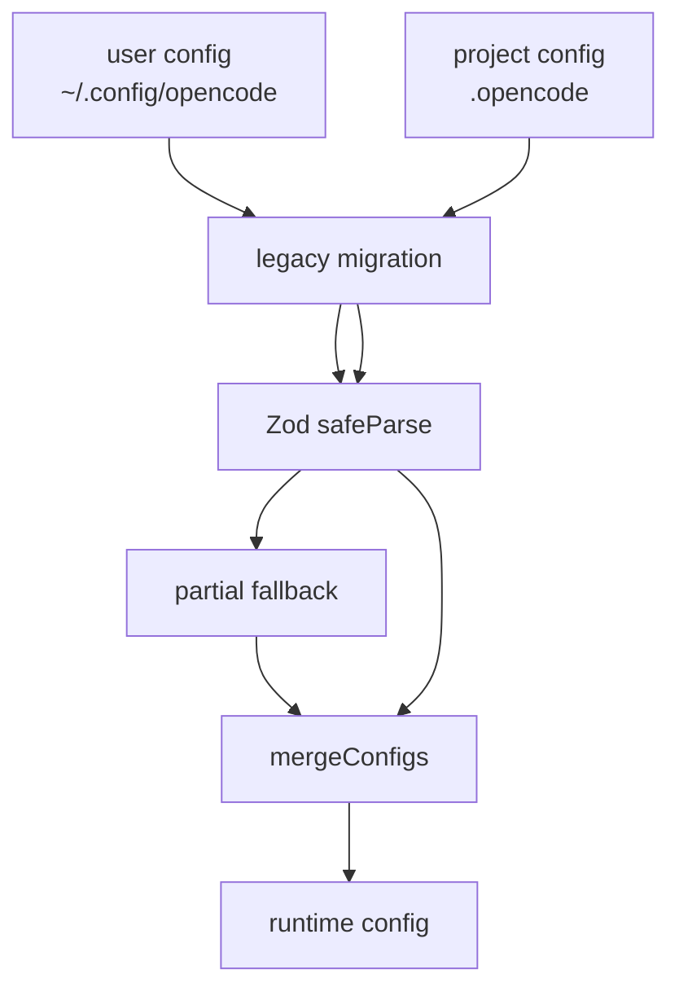

# 5장: JSONC 설정 병합과 마이그레이션

오마오 설정은 한 파일에서 끝나지 않는다. 사용자 설정과 프로젝트 설정을 모두 읽고, JSONC를 파싱하고, legacy 이름을 migration하며, Zod schema로 검증한 뒤 deep merge한다. 이 과정은 플러그인의 실제 정책 엔진이다.

## 왜 중요한가

플러그인은 사용자별 기본값과 저장소별 규칙을 동시에 다뤄야 한다. 개인은 자주 쓰는 provider, agent model, disabled hook을 원하고, 프로젝트는 팀 단위 규칙과 MCP, command, skill 정책을 원한다. 설정 병합이 불명확하면 같은 플러그인이 디렉터리에 따라 예측 불가능하게 동작한다.

## 소스 앵커

- `src/plugin-config.ts`
- `src/config/schema/oh-my-opencode-config.ts`
- `src/shared/deep-merge`
- `src/shared/plugin-identity`
- `src/shared/migration/`
- `src/cli/config-manager/`

## 병합 흐름



## 핵심 메커니즘

`loadPluginConfig(directory, ctx)`는 사용자 config를 base로 읽고 프로젝트 config를 override로 읽는다. 두 파일 모두 `.jsonc`를 선호하고 legacy basename을 발견하면 canonical 이름으로 migration한다.

`safeParse`가 실패해도 즉시 전체 설정을 버리지 않는다. `parseConfigPartially`가 유효한 section만 살리고, invalid section은 load error로 기록한다. 플러그인 설정은 운영 경로이므로 부분 복구가 중요하다.

`mergeConfigs`는 모든 값을 같은 방식으로 합치지 않는다. `agents`, `categories`, `claude_code`는 deep merge한다. `disabled_*`와 `agent_definitions`, `mcp_env_allowlist`는 set union한다. 나머지는 override가 base를 대체한다. 이 구분이 설정 의미론의 핵심이다.

`git_master`는 별도 예외를 가진다. default를 기준으로 사용자 override와 프로젝트 override를 다시 얹는다. 특정 필드는 일반 deep merge보다 explicit override 추적이 중요하기 때문이다.

## 트레이드오프

부분 파싱은 사용자 경험을 좋게 만들지만, 잘못된 section이 조용히 빠질 수 있다. 그래서 오마오는 load error와 log를 남긴다. 설정 시스템은 관대해야 하지만, 관대함이 침묵이 되어서는 안 된다.

## 핵심 코드

`src/plugin-config.ts`의 병합 규칙이다. 필드별 의미론이 코드로 고정되어 있다.

```ts
export function mergeConfigs(
  base: OhMyOpenCodeConfig,
  override: OhMyOpenCodeConfig
): OhMyOpenCodeConfig {
  return {
    ...base,
    ...override,
    agents: deepMerge(base.agents, override.agents),
    categories: deepMerge(base.categories, override.categories),
    agent_definitions: [
      ...new Set([
        ...(base.agent_definitions ?? []),
        ...(override.agent_definitions ?? []),
      ]),
    ],
    disabled_agents: [
      ...new Set([
        ...(base.disabled_agents ?? []),
        ...(override.disabled_agents ?? []),
      ]),
    ],
    disabled_hooks: [
      ...new Set([
        ...(base.disabled_hooks ?? []),
        ...(override.disabled_hooks ?? []),
      ]),
    ],
    disabled_tools: [
      ...new Set([
        ...(base.disabled_tools ?? []),
        ...(override.disabled_tools ?? []),
      ]),
    ],
    claude_code: deepMerge(base.claude_code, override.claude_code),
  }
}
```

## 소스 그라운딩

- `PARTIAL_STRING_ARRAY_KEYS`에는 `disabled_mcps`, `disabled_agents`, `disabled_skills`, `disabled_hooks`, `disabled_commands`, `disabled_tools`, `mcp_env_allowlist`, `agent_definitions`가 들어 있다. 이 필드들은 schema 전체가 실패해도 배열 검증만 통과하면 살릴 수 있다.
- `loadConfigFromPath()`는 `migrateConfigFile(configPath, rawConfig)`를 먼저 호출한 뒤 `OhMyOpenCodeConfigSchema.safeParse(rawConfig)`를 수행한다.
- `parseConfigPartially()`는 root schema에 `{ [key]: rawConfig[key] }` 형태로 section별 safeParse를 다시 시도한다.
- `mergeConfigs()`는 `agent_definitions`와 모든 `disabled_*` 배열을 `new Set([...base, ...override])`로 dedupe한다.
- 마지막에 `mcp_env_allowlist`는 `userConfig?.mcp_env_allowlist ?? []`로 되돌린다. 프로젝트가 사용자의 env allowlist를 넓히지 못하게 하는 보수적 선택이다.

## 빌더에게 남는 것

설정 병합은 feature가 아니라 runtime contract다. 어떤 필드는 덮어쓰고, 어떤 필드는 합치고, 어떤 필드는 migration해야 하는지 문서화해야 한다. 플러그인이 커질수록 이 의미론이 제품 안정성을 결정한다.
