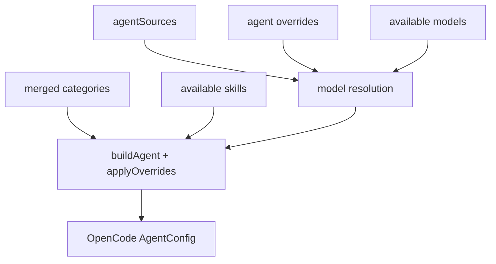

# 6장: 에이전트 생성과 모델 해상도

오마오의 에이전트는 정적 prompt 묶음이 아니다. built-in agent factory, 사용자 override, model requirement, category, skill, provider cache, UI selected model이 합쳐져 최종 OpenCode agent config가 된다.

## 왜 중요한가

에이전트를 늘리는 것은 쉽다. 어려운 것은 어떤 모델이 그 에이전트를 감당할 수 있는지, 사용자가 선택한 UI 모델을 존중할지, fallback chain을 언제 쓸지, disabled agent와 custom definition을 어떻게 섞을지 결정하는 일이다.

## 소스 앵커

- `src/agents/builtin-agents.ts`
- `src/agents/builtin-agents/general-agents.ts`
- `src/agents/builtin-agents/model-resolution.ts`
- `src/agents/agent-builder.ts`
- `src/shared/model-requirements.ts`
- `src/plugin-handlers/agent-config-handler.ts`

## 생성 흐름



## 핵심 메커니즘

`agentSources`는 Sisyphus, Hephaestus, Oracle, Librarian, Explore, Multimodal Looker, Metis, Momus, Atlas, Sisyphus Junior를 factory 또는 config로 보관한다. 하지만 생성 순서는 단순 map 순회가 아니다. Sisyphus와 Hephaestus는 available agents 정보를 필요로 하므로 별도 경로를 가진다.

`collectPendingBuiltinAgents`는 일반 에이전트를 먼저 수집한다. disabled agent를 제거하고, agent별 model requirement를 확인하고, primary agent라면 UI selected model을 존중한다. 사용자 override가 있으면 우선하고, 해상도에 실패하면 fallback model을 찾는다.

Sisyphus는 orchestrator에 가깝다. available agents, available skills, categories를 받아 delegation prompt를 구성한다. Hephaestus 역시 구현 중심 agent로 별도 구성 경로를 가진다. Atlas는 작업 추적과 continuation 성격이 강해 특별한 context를 필요로 한다.

## 트레이드오프

동적 agent 생성은 사용자 설정을 잘 반영한다. 대신 agent config를 읽는 것만으로 실제 동작을 알기 어렵다. 최종 config는 provider cache, disabled list, category merge, skill discovery 결과에 따라 달라진다.

## 핵심 코드

`src/agents/builtin-agents.ts`의 agent source와 special-case 생성 순서다.

```ts
const agentSources: Record<BuiltinAgentName, AgentSource> = {
  sisyphus: createSisyphusAgent,
  hephaestus: createHephaestusAgent,
  oracle: createOracleAgent,
  librarian: createLibrarianAgent,
  explore: createExploreAgent,
  "multimodal-looker": createMultimodalLookerAgent,
  metis: createMetisAgent,
  momus: createMomusAgent,
  atlas: createAtlasAgent as AgentFactory,
  "sisyphus-junior":
    createSisyphusJuniorAgentWithOverrides as unknown as AgentFactory,
}
```

```ts
const { pendingAgentConfigs, availableAgents } = collectPendingBuiltinAgents({
  agentSources,
  agentMetadata,
  disabledAgents,
  agentOverrides,
  directory,
  systemDefaultModel,
  mergedCategories,
  gitMasterConfig,
  browserProvider,
  uiSelectedModel,
  availableModels,
  isFirstRunNoCache,
  disabledSkills,
  disableOmoEnv,
})

const sisyphusConfig = maybeCreateSisyphusConfig({ ... })
const hephaestusConfig = maybeCreateHephaestusConfig({ ... })

for (const [name, config] of pendingAgentConfigs) {
  result[name] = config
}

const atlasConfig = maybeCreateAtlasConfig({ ... })
```

## 소스 그라운딩

- `BuiltinAgentNameSchema`는 11개 agent를 정의한다. `OverridableAgentNameSchema`는 여기에 `build`, `plan`, `OpenCode-Builder`까지 포함해 config override 범위를 넓힌다.
- `createBuiltinAgents()`는 provider cache를 읽은 뒤 `fetchAvailableModels(undefined, { connectedProviders })`를 호출한다. agent 생성이 provider availability와 결합되어 있다.
- `collectPendingBuiltinAgents()`는 `sisyphus`, `hephaestus`, `atlas`, `sisyphus-junior`를 일반 순회에서 제외한다. 이 agent들은 별도 생성 순서가 필요하다.
- `applyModelResolution()`은 primary agent일 때 UI selected model을 받아들일 수 있고, user override, requirement, available model, system default를 함께 본다.
- `applyAgentConfig()`는 Sisyphus가 활성화된 경우 `default_agent`를 Sisyphus runtime name으로 설정하고, assembly order를 `Sisyphus -> Hephaestus -> Prometheus -> Atlas`로 고정한다.
- `createProtectedAgentNameSet()`과 `filterProtectedAgentOverrides()`는 사용자/프로젝트/플러그인 agent가 built-in 핵심 agent를 덮어쓰지 못하게 한다.

## 빌더에게 남는 것

에이전트 시스템은 prompt 파일보다 모델 해상도 정책이 먼저다. 어떤 agent가 primary인지, 어떤 agent가 subagent인지, 어떤 agent가 특정 모델을 요구하는지 먼저 결정해야 prompt와 tool 권한도 안정된다.
