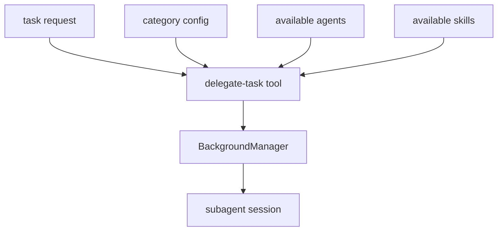

# 7장: 카테고리, 위임, 하위 에이전트 라우팅

오마오에서 카테고리는 UI label이 아니다. 모델이 작업을 어떤 에이전트에게 맡길지 판단하는 라우팅 언어다. `delegate-task`와 Sisyphus prompt는 category를 통해 작업 유형, 적합한 모델, 사용 가능한 skill을 연결한다.

## 왜 중요한가

하위 에이전트가 많아지면 "누구에게 맡길 것인가"가 가장 큰 비용이 된다. 라우팅 기준이 prompt 안에만 있으면 유지보수가 어렵고, 코드 안에만 있으면 모델이 이해하지 못한다. 오마오는 categories config와 prompt metadata를 함께 사용한다.

## 소스 앵커

- `src/tools/delegate-task/`
- `src/tools/delegate-task/constants.ts`
- `src/agents/dynamic-agent-prompt-builder.ts`
- `src/agents/dynamic-agent-tool-categorization.ts`
- `src/shared/merge-categories.ts`
- `src/features/background-agent/`

## 위임 흐름



## 핵심 메커니즘

`DEFAULT_CATEGORIES`와 사용자 `categories`는 merge된다. 각 category는 description과 model requirement를 가질 수 있고, 이 정보는 Sisyphus가 작업을 분해할 때 사용된다.

`delegate-task`는 background manager를 직접 사용한다. 즉 위임은 단순 tool output이 아니라 실제 subagent session을 만든다. 생성된 session은 tmux manager, task history, notification 상태와 연결될 수 있다.

`call_omo_agent`는 특정 agent 호출에 가깝고, `task` 또는 `delegate-task`는 category와 작업 성격을 보고 더 넓게 라우팅한다. 이 둘을 분리하는 이유는 "명시적 agent 호출"과 "작업 기반 위임"의 UX가 다르기 때문이다.

## 실패 모드

라우팅 실패는 보통 세 가지다. category가 모호하거나, 필요한 모델이 사용 가능하지 않거나, 하위 세션 sync가 늦어진다. 오마오는 retry hook, sync timeout, fallback model, available model cache를 통해 이 문제를 완화한다.

## 핵심 코드

`src/tools/delegate-task/tools.ts`의 실행 분기다. category와 subagent 직접 지정이 갈라지고, sync/background도 여기서 나뉜다.

```ts
if (delegateTaskArgs.task_id) {
  if (runInBackground) {
    return executeBackgroundContinuation(
      delegateTaskArgs,
      ctx,
      options,
      parentContext,
      continuationSystemContent,
    )
  }
  return executeSyncContinuation(
    delegateTaskArgs,
    ctx,
    options,
    parentContext,
    undefined,
    continuationSystemContent,
  )
}

if (!delegateTaskArgs.category && !delegateTaskArgs.subagent_type) {
  return `Invalid arguments: Must provide either category or subagent_type.`
}

if (delegateTaskArgs.category) {
  const resolution = await resolveCategoryExecution(
    delegateTaskArgs,
    options,
    inheritedModel,
    systemDefaultModel,
  )
  if (resolution.error) return resolution.error
  agentToUse = resolution.agentToUse
  categoryModel = resolution.categoryModel
  fallbackChain = resolution.fallbackChain
} else {
  const resolution = await resolveSubagentExecution(
    delegateTaskArgs,
    options,
    parentContext.agent,
    categoryExamples,
  )
  if (resolution.error) return resolution.error
  agentToUse = resolution.agentToUse
  categoryModel = resolution.categoryModel
  fallbackChain = resolution.fallbackChain
}
```

## 소스 그라운딩

- `createDelegateTask()`의 args schema는 `load_skills`, `prompt`, `run_in_background`, `category`, `subagent_type`, `task_id`, `command`를 받는다. 특히 `run_in_background`는 required 설명을 가진다.
- `category`와 `subagent_type`이 모두 없으면 tool은 즉시 `Invalid arguments`를 반환한다. 위임은 반드시 category 기반이거나 agent 직접 지정이어야 한다.
- `resolveSkillContent()`는 `load_skills`를 먼저 처리하고, 그 결과는 `buildSystemContent()`로 subagent system content에 들어간다.
- `resolveParentContext()`는 parent session의 agent/model/tools를 읽어 위임에 상속한다. `inheritedModel`은 parent model이 있을 때 `${providerID}/${modelID}` 형태로 만들어진다.
- `resolveModelForDelegateTask()`는 user model, user-configured category model, available model fuzzy match, user fallback models, fallback chain, system default 순서로 모델을 찾는다.
- unstable agent가 sync 실행으로 요청되면 `executeUnstableAgentTask()`로 우회한다. 코드상 `isUnstableAgent && run_in_background === false`가 별도 경로를 만든다.

## 빌더에게 남는 것

멀티 에이전트 플러그인은 agent 목록보다 routing vocabulary가 먼저다. 모델이 읽을 수 있고 설정이 확장할 수 있는 category 계층을 만들어야 위임이 운영 가능한 기능이 된다.
