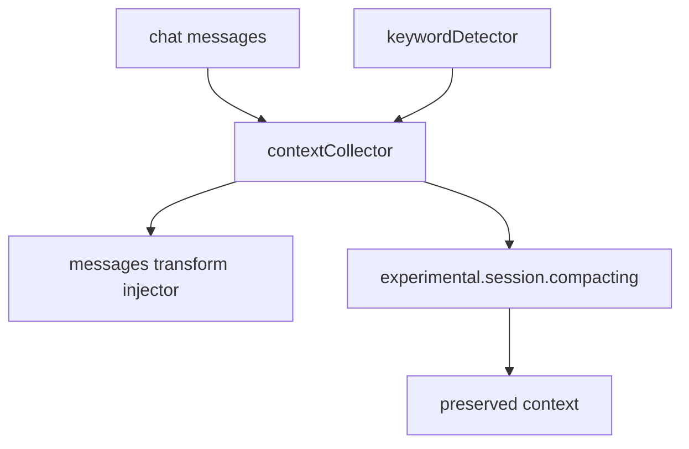

# 8장: 컨텍스트 주입과 컴팩션 보존

대화가 길어지면 중요한 문맥은 사라진다. 오마오는 이 문제를 OpenCode의 transform hook과 compaction hook으로 다룬다. 문맥을 단순히 더 많이 넣는 것이 아니라, 수집하고 주입하고 compaction 시점에 다시 보존한다.

## 왜 중요한가

플러그인은 모든 메시지를 영구히 들고 있을 수 없다. 하지만 agent orchestration, keyword detection, rules injection, todo preservation 같은 기능은 이전 상태를 알아야 한다. 그래서 오마오는 메시지 변환 계층과 compaction 계층을 따로 둔다.

## 소스 앵커

- `src/features/context-injector/`
- `src/plugin/hooks/create-transform-hooks.ts`
- `src/hooks/compaction-context-injector/`
- `src/hooks/compaction-todo-preserver/`
- `src/index.compacting.test.ts`
- `src/plugin/messages-transform.ts`

## 문맥 흐름



## 핵심 메커니즘

`createTransformHooks`는 Claude Code hooks, keyword detector, context injector, thinking block validator, tool pair validator를 만든다. 여기서 `contextCollector`가 공유된다. keyword detection이 수집한 정보는 이후 messages transform에서 다시 주입될 수 있다.

`experimental.session.compacting`은 `src/index.ts`에서 별도로 감싼다. compaction context injector와 todo preserver가 sessionID별로 capture를 수행하고, Claude Code hook도 같은 이벤트에 개입할 수 있다. 이후 injector가 만든 context를 output에 추가한다.

이 구조는 compaction을 "OpenCode가 알아서 하는 일"로만 보지 않는다. 플러그인이 만든 상태 중 사라지면 안 되는 것을 compaction output에 다시 실어 보내는 경계로 본다.

## 트레이드오프

문맥 주입은 강력하지만 과하면 모델 입력을 흐린다. 그래서 오마오는 keyword, rules, directory info, todo 같은 목적별 hook으로 나누고, 모든 것을 하나의 context blob에 넣지 않는다.

## 핵심 코드

`src/plugin/hooks/create-transform-hooks.ts`에서 transform 계층은 shared collector를 중심으로 만들어진다.

```ts
const claudeCodeHooks = isHookEnabled("claude-code-hooks")
  ? safeCreateHook(
      "claude-code-hooks",
      () =>
        createClaudeCodeHooksHook(
          ctx,
          {
            disabledHooks: (pluginConfig.claude_code?.hooks ?? true)
              ? undefined
              : true,
            keywordDetectorDisabled: !isHookEnabled("keyword-detector"),
          },
          contextCollector,
        ),
      { enabled: safeHookEnabled },
    )
  : null

const keywordDetector = isHookEnabled("keyword-detector")
  ? safeCreateHook(
      "keyword-detector",
      () => createKeywordDetectorHook(ctx, contextCollector, ralphLoop ?? undefined),
      { enabled: safeHookEnabled },
    )
  : null

const contextInjectorMessagesTransform =
  createContextInjectorMessagesTransformHook(contextCollector)
```

## 소스 그라운딩

- `createTransformHooks()`는 `contextCollector`를 `createClaudeCodeHooksHook()`, `createKeywordDetectorHook()`, `createContextInjectorMessagesTransformHook()`에 공유한다.
- `contextInjectorMessagesTransform`는 disabled hook 여부와 상관없이 만들어진다. 수집된 context를 messages transform에서 사용할 기본 통로다.
- `src/index.ts`의 `experimental.session.compacting`은 `compactionContextInjector.capture()`, `compactionTodoPreserver.capture()`, Claude Code compacting hook, `inject()` 순서로 실행된다.
- `compactionContextInjector`는 background manager를 입력으로 받아 하위 작업 상태를 compaction context에 반영할 수 있다.
- `compactionTodoPreserver`는 ctx만 받아 별도 hook으로 만들어진다. todo 보존은 context 수집과 다른 책임으로 분리되어 있다.

## 빌더에게 남는 것

긴 대화를 다루는 플러그인은 compaction을 설계해야 한다. 주입할 문맥, 버릴 문맥, compaction 때 재구성할 문맥을 나누지 않으면 장기 세션에서 기능이 조용히 무너진다.
