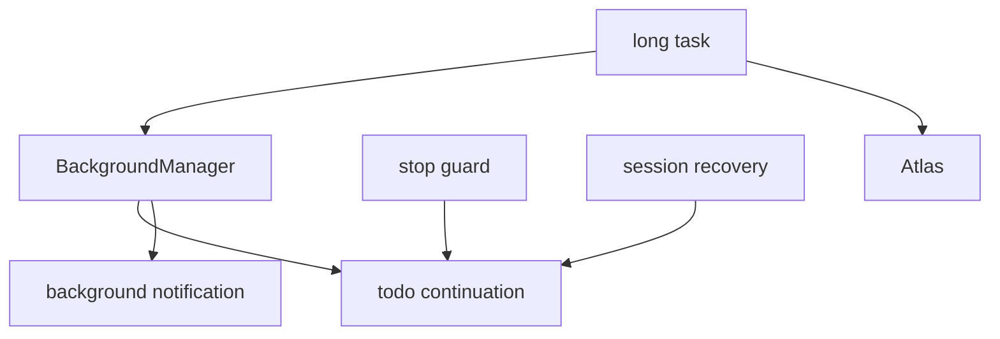

# 9장: continuation과 보조 세션 운영

오마오의 continuation 계층은 작업이 한 번의 답변으로 끝나지 않는다는 사실을 인정한다. background agent, todo continuation, stop guard, session recovery, Atlas hook은 모두 장기 작업을 세션 상태로 관리하기 위한 장치다.

## 왜 중요한가

사용자는 긴 작업을 맡기고 싶어 한다. 하지만 모델은 중간에 멈출 수 있고, 사용자는 멈추고 싶을 수 있으며, compaction은 문맥을 줄일 수 있다. continuation이 없으면 긴 작업은 운에 의존한다.

## 소스 앵커

- `src/plugin/hooks/create-continuation-hooks.ts`
- `src/hooks/todo-continuation-enforcer/`
- `src/hooks/stop-continuation-guard/`
- `src/hooks/session-recovery/`
- `src/hooks/background-notification/`
- `src/hooks/atlas/`

## continuation 흐름



## 핵심 메커니즘

`createContinuationHooks`는 core hook이 만든 `sessionRecovery`와 background manager를 받아 continuation 전용 훅을 만든다. 이 의존성 방향이 중요하다. recovery는 core lifecycle 문제지만, recovery 결과를 continuation enforcer에 알려야 하기 때문이다.

`stop-continuation-guard`는 사용자가 continuation을 멈출 수 있는 경계다. `todo-continuation-enforcer`는 남은 todo가 있으면 계속 진행하도록 압력을 준다. 둘은 서로 반대 방향의 UX를 제공하지만 같은 상태 모델 안에서 만난다.

`background-notification`은 parent session이 하위 작업 상태를 알 수 있게 한다. Atlas hook은 작업 계획과 진행 추적을 더 높은 수준에서 다룬다.

## 실패 모드

장기 작업에서 가장 위험한 실패는 "멈췄는데 멈춘 줄 모르는 상태"다. 오마오는 recovery callback, notification, stop guard를 통해 이 상태를 줄인다. 그래도 모든 provider 오류와 세션 복구를 완벽히 숨기지는 않는다. 숨기기보다 드러내고 재시도 가능한 상태로 만드는 쪽을 택한다.

## 핵심 코드

`src/plugin/hooks/create-continuation-hooks.ts`에서 recovery와 continuation이 만나는 지점이다.

```ts
if (sessionRecovery) {
  const onAbortCallbacks: Array<(sessionID: string) => void> = []
  const onRecoveryCompleteCallbacks: Array<(sessionID: string) => void> = []

  if (todoContinuationEnforcer) {
    onAbortCallbacks.push(todoContinuationEnforcer.markRecovering)
    onRecoveryCompleteCallbacks.push(
      todoContinuationEnforcer.markRecoveryComplete,
    )
  }

  if (onAbortCallbacks.length > 0) {
    sessionRecovery.setOnAbortCallback((sessionID: string) => {
      for (const callback of onAbortCallbacks) callback(sessionID)
    })
  }

  if (onRecoveryCompleteCallbacks.length > 0) {
    sessionRecovery.setOnRecoveryCompleteCallback((sessionID: string) => {
      for (const callback of onRecoveryCompleteCallbacks) callback(sessionID)
    })
  }
}
```

## 소스 그라운딩

- `createContinuationHooks()`는 `sessionRecovery`가 있으면 `setOnAbortCallback()`과 `setOnRecoveryCompleteCallback()`에 continuation 관련 callback을 연결한다.
- `todoContinuationEnforcer`는 `backgroundManager`와 `isContinuationStopped`를 함께 받는다. todo를 계속 밀어붙이되 stop state를 존중한다.
- `stopContinuationGuard`는 `BackgroundManager`를 받아 stop state와 background task 중단을 연결한다.
- `backgroundNotificationHook`은 `BackgroundManager`만 받아 parent session notification을 담당한다. notification은 event handler 안에 직접 들어 있지 않다.
- `atlasHook`은 `directory`, `backgroundManager`, `agentOverrides`, `autoCommit`을 받는다. 작업 추적이 agent 설정과 start-work 정책을 동시에 본다.

## 빌더에게 남는 것

긴 작업을 지원하려면 continuation은 prompt 문구가 아니라 상태 모델이어야 한다. stop, retry, recovery, notification이 한 모델 안에서 만날 때 사용자는 긴 작업을 맡길 수 있다.
