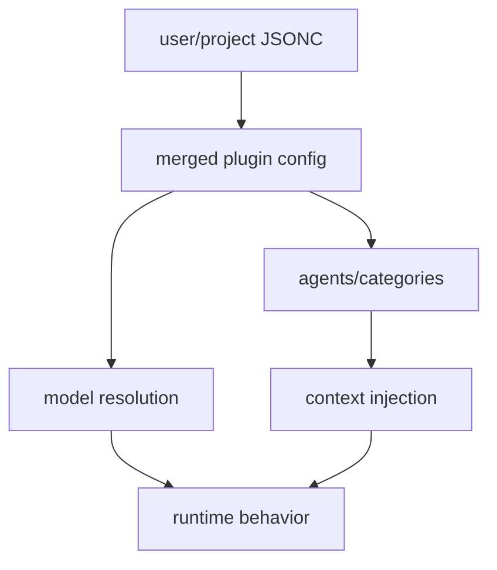

# 제2부: 대화를 어떻게 정책과 문맥으로 바꾸는가

플러그인이 사용자 대화를 직접 소유하지 못한다면, 무엇을 소유해야 하는가. 오마오의 답은 설정, 에이전트 정의, 모델 선택, 카테고리, 문맥 주입, continuation 상태다. 사용자가 채팅에 입력한 의도는 곧바로 모델 호출로 가지 않는다. 먼저 플러그인의 정책과 문맥 계층을 통과한다.

이 부는 메시지 바깥의 상태를 본다. JSONC 설정은 런타임 정책이 되고, 에이전트 정의는 모델 요구사항과 도구 권한으로 바뀌며, compaction 시점에는 사라질 수 있는 문맥을 별도로 보존한다.

## 핵심 소스

- `src/plugin-config.ts`
- `src/config/schema/`
- `src/agents/builtin-agents.ts`
- `src/tools/delegate-task/`
- `src/features/context-injector/`
- `src/hooks/compaction-*`
