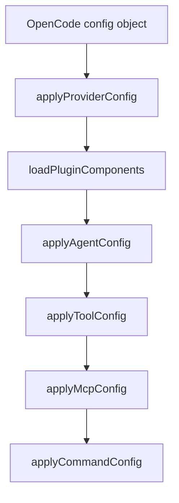

# 10장: config 핸들러의 6단계 합성 파이프라인

OpenCode의 `config` handler는 오마오가 가장 넓게 시스템을 바꾸는 지점이다. 플러그인은 여기서 provider, plugin component, agent, tool, MCP, command를 순서대로 합성한다.

## 왜 중요한가

사용자는 오마오를 설치한 뒤 OpenCode 설정을 직접 모두 고치고 싶어 하지 않는다. 플러그인은 설정을 대신 확장해야 한다. 하지만 무작정 덮어쓰면 사용자의 기존 config가 사라진다. 그래서 config handler는 "추가"와 "존중" 사이의 순서를 가져야 한다.

## 소스 앵커

- `src/plugin-handlers/config-handler.ts`
- `src/plugin-handlers/provider-config-handler.ts`
- `src/plugin-handlers/plugin-components-loader.ts`
- `src/plugin-handlers/agent-config-handler.ts`
- `src/plugin-handlers/tool-config-handler.ts`
- `src/plugin-handlers/mcp-config-handler.ts`
- `src/plugin-handlers/command-config-handler.ts`

## 합성 흐름



## 핵심 메커니즘

`createConfigHandler`는 formatter 설정을 먼저 보존한다. 이후 provider config를 적용하고 formatter cache를 비운다. formatter를 마지막에 되돌리는 이유는 플러그인이 설정을 합성하는 과정에서 사용자의 formatter 의도를 잃지 않기 위해서다.

plugin components는 별도 단계로 로드된다. 외부 plugin component가 agent, MCP, command를 제공할 수 있으므로, built-in 구성 전에 component 목록을 확보해야 한다.

agent config가 먼저 적용되고 tool config가 뒤따른다. 도구 권한과 사용 가능성은 어떤 agent가 등록됐는지에 영향을 받기 때문이다. MCP와 command는 이후 합쳐진다.

## 충돌 처리

MCP handler는 user config가 `.mcp.json`에서 온 서버를 덮어쓰면 warning을 남긴다. 사용자가 `enabled: false`로 명시한 MCP는 merge 이후에도 비활성 상태를 유지한다. 이처럼 config handler는 단순 merge가 아니라 사용자 의도를 복원하는 일을 한다.

## 핵심 코드

`src/plugin-handlers/config-handler.ts`의 실제 config mutation 순서다.

```ts
return async (config: Record<string, unknown>) => {
  const formatterConfig = config.formatter

  setAdditionalAllowedMcpEnvVars(pluginConfig.mcp_env_allowlist ?? [])
  applyProviderConfig({ config, modelCacheState })
  clearFormatterCache()

  const pluginComponents = await loadPluginComponents({ pluginConfig })

  const agentResult = await applyAgentConfig({
    config,
    pluginConfig,
    ctx,
    pluginComponents,
  })

  applyToolConfig({ config, pluginConfig, agentResult })
  await applyMcpConfig({ config, pluginConfig, pluginComponents })
  await applyCommandConfig({ config, pluginConfig, ctx, pluginComponents })

  config.formatter = formatterConfig
}
```

## 소스 그라운딩

- `createConfigHandler()`는 `formatterConfig`를 먼저 보존하고 모든 합성 뒤 `config.formatter = formatterConfig`로 되돌린다.
- `setAdditionalAllowedMcpEnvVars(pluginConfig.mcp_env_allowlist ?? [])`는 config handler 진입 시점에 호출된다. MCP env allowlist는 `.mcp.json` loader보다 먼저 설정된다.
- `applyProviderConfig()`는 provider model context limit과 image input capability를 `modelCacheState`에 채운다.
- `loadPluginComponents()`는 Claude Code plugin component loading을 `Promise.race()`와 timeout으로 감싼다. 기본 timeout은 `experimental.plugin_load_timeout_ms ?? 10000`이다.
- `applyAgentConfig()` 결과가 `applyToolConfig()` 입력으로 들어간다. agent permission을 도구 정책에 반영하기 위해 순서가 고정되어 있다.
- `applyMcpConfig()`는 built-in MCP, Claude Code MCP, user MCP, plugin component MCP를 순서대로 합친 뒤 disabled set을 마지막에 적용한다.

## 빌더에게 남는 것

플러그인의 config handler는 작은 compiler에 가깝다. 여러 입력을 받아 OpenCode가 이해하는 최종 config를 만든다. 순서가 곧 의미론이므로, 단계 이름을 숨기지 말고 코드 구조로 드러내야 한다.
