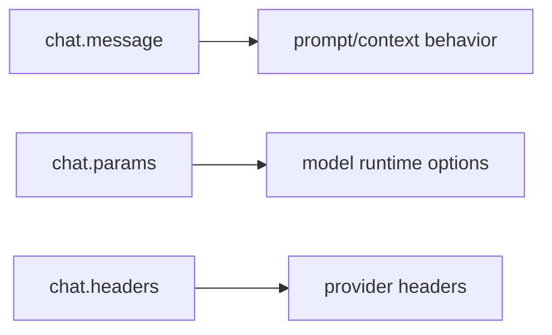

# 11장: chat.message, chat.params, chat.headers

채팅 관련 handler는 모델 호출 직전의 사용자 경험을 바꾼다. 오마오는 메시지, 파라미터, 헤더를 각각 다른 계약으로 다룬다. 같은 "채팅" 표면이라도 책임은 다르다.

## 왜 중요한가

플러그인이 채팅에 개입할 수 있는 지점은 민감하다. 메시지를 바꾸면 모델이 보는 의도가 바뀌고, params를 바꾸면 비용과 성능이 바뀌며, headers를 바꾸면 provider 또는 gateway 동작이 바뀐다.

## 소스 앵커

- `src/plugin/chat-message.ts`
- `src/plugin/chat-params.ts`
- `src/plugin/chat-headers.ts`
- `src/hooks/keyword-detector/`
- `src/hooks/think-mode/`
- `src/hooks/anthropic-effort/`
- `src/shared/first-message-variant`

## handler 분리



## 핵심 메커니즘

`chat.message`는 첫 메시지 variant gate, session setup, keyword detection 같은 사용자 입력 주변의 기능을 연결한다. 여기서는 메시지 의미와 세션 초기 상태가 중요하다.

`chat.params`는 Anthropic effort, think mode, runtime fallback override 같은 모델 호출 파라미터에 가깝다. 모델별로 의미가 다른 옵션은 여기서 통제한다.

`chat.headers`는 Copilot x-initiator header 같은 provider 주변 요구사항을 처리한다. 이 로직을 params와 섞지 않는 이유는 네트워크 계층의 정보와 모델 추론 계층의 정보가 다르기 때문이다.

## 트레이드오프

chat handler가 늘어나면 사용자 입력의 경로가 복잡해진다. 오마오는 handler별 파일을 유지하고, 실제 정책은 hook factory로 내려보낸다. 덕분에 채팅 표면은 얇게 남고 기능별 테스트가 가능해진다.

## 핵심 코드

`src/plugin/chat-message.ts`는 chat hook 호출 순서를 명시적으로 고정한다.

```ts
await hooks.stopContinuationGuard?.["chat.message"]?.(input)
await hooks.backgroundNotificationHook?.["chat.message"]?.(input, output)
await hooks.runtimeFallback?.["chat.message"]?.(input, output)
await hooks.keywordDetector?.["chat.message"]?.(input, output)
await hooks.thinkMode?.["chat.message"]?.(input, output)
await hooks.claudeCodeHooks?.["chat.message"]?.(input, output)
await hooks.autoSlashCommand?.["chat.message"]?.(input, output)
await hooks.noSisyphusGpt?.["chat.message"]?.(input, output)
await hooks.noHephaestusNonGpt?.["chat.message"]?.(input, output)

if (hooks.startWork && isStartWorkHookOutput(output)) {
  const promptText = extractPromptText(output.parts)
  if (isStartWorkFallbackTemplate(promptText)) {
    clearStoppedContinuationBeforeWorkStart(
      hooks,
      input.sessionID,
      "start-work",
    )
  }
  await hooks.startWork["chat.message"]?.(input, output)
}
```

## 소스 그라운딩

- `createChatMessageHandler()`는 입력 agent가 있으면 `setSessionAgent(input.sessionID, input.agent)`를 먼저 호출한다.
- 첫 메시지 여부는 `firstMessageVariantGate.shouldOverride()`와 `markApplied()`로 관리된다. session created 이벤트와 chat message 사이의 상태를 잇는 장치다.
- main session에서 model override가 없고 explicit agent model override도 없으면 `getStoredMainSessionModel()`로 이전 session model을 복원한다.
- runtime fallback이 켜져 있으면 `modelFallback["chat.message"]`는 건너뛴다. proactive fallback과 runtime fallback을 동시에 적용하지 않기 위한 분기다.
- handler 순서는 stop continuation, background notification, runtime fallback, keyword detector, think mode, Claude Code hooks, auto slash command, 모델 guard, start-work 순서로 흐른다.
- model cache가 없으면 TUI toast로 provider cache missing warning을 띄운다. cache 부재가 기능 저하로 이어지기 때문이다.

## 빌더에게 남는 것

채팅을 바꾸는 플러그인은 개입 지점을 엄격히 나눠야 한다. 메시지 내용, 모델 옵션, provider header를 하나의 hook에서 처리하면 디버깅이 어려워진다.
