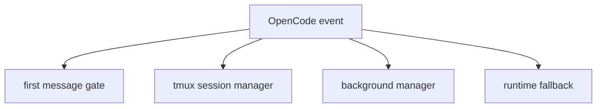

# 12장: event 핸들러와 세션 생명주기

OpenCode의 `event` handler는 오마오가 세션 생명주기를 운영 상태로 바꾸는 지점이다. 세션 생성, 삭제, idle, error는 단순 알림이 아니라 manager와 외부 통합을 움직이는 신호다.

## 왜 중요한가

하위 에이전트, tmux pane, fallback, first message gate는 모두 세션의 생성과 종료를 알아야 한다. event handler가 없다면 플러그인은 "현재 어떤 작업이 살아 있는지"를 안정적으로 추적할 수 없다.

## 소스 앵커

- `src/plugin/event.ts`
- `src/create-managers.ts`
- `src/features/tmux-subagent/`
- `src/hooks/runtime-fallback/`
- `src/shared/first-message-variant`

## 생명주기 흐름



## 핵심 메커니즘

세션 생성 이벤트는 first-message variant gate에 기록된다. 이 정보는 첫 사용자 메시지를 다르게 처리할 수 있는 근거가 된다. 같은 이벤트가 tmux manager에도 전달되어 하위 세션과 pane 추적을 맞춘다.

세션 오류는 runtime fallback과 연결된다. proactive model fallback이 `chat.params` 주변에서 작동한다면, runtime fallback은 실제 session error를 보고 반응한다. 두 fallback 시스템을 나눈 이유는 실패가 발생하는 시점과 정보가 다르기 때문이다.

`session.deleted`에서는 session agent, fallback chain, message cursor, background output consumption, session model, prompt params, sync subagent registry, session tools, skill MCP connection, LSP temp clients가 정리된다. 이 장의 핵심은 event handler가 알림기가 아니라 cleanup 경계라는 점이다.

## 트레이드오프

event handler는 많은 기능을 연결하기 쉽다. 하지만 모든 기능이 event handler 안에 직접 들어오면 병목이 된다. 오마오는 manager와 hook에 책임을 위임하고 event handler는 라우팅 계층으로 둔다.

## 핵심 코드

`src/plugin/event.ts`의 `session.deleted` cleanup은 event handler가 상태 전이 경계라는 사실을 가장 잘 보여 준다.

```ts
if (event.type === "session.deleted") {
  const sessionInfo = props?.info as { id?: string } | undefined
  if (sessionInfo?.id === getMainSessionID()) {
    setMainSession(undefined)
  }

  if (sessionInfo?.id) {
    const wasSyncSubagentSession = syncSubagentSessions.has(sessionInfo.id)
    clearSessionAgent(sessionInfo.id)
    lastHandledModelErrorMessageID.delete(sessionInfo.id)
    lastHandledRetryStatusKey.delete(sessionInfo.id)
    lastKnownModelBySession.delete(sessionInfo.id)
    if (modelFallback) {
      clearPendingModelFallback(modelFallback, sessionInfo.id)
      clearSessionFallbackChain(modelFallback, sessionInfo.id)
    }
    resetMessageCursor(sessionInfo.id)
    clearBackgroundOutputConsumptionsForParentSession(sessionInfo.id)
    clearBackgroundOutputConsumptionsForTaskSession(sessionInfo.id)
    firstMessageVariantGate.clear(sessionInfo.id)
    clearSessionModel(sessionInfo.id)
    clearSessionPromptParams(sessionInfo.id)
    syncSubagentSessions.delete(sessionInfo.id)
    if (wasSyncSubagentSession) {
      subagentSessions.delete(sessionInfo.id)
    }
    deleteSessionTools(sessionInfo.id)
    await managers.skillMcpManager.disconnectSession(sessionInfo.id)
    await lspManager.cleanupTempDirectoryClients()
  }
}
```

## 소스 그라운딩

- `dispatchToHooks()`는 event hook들을 `runEventHookSafely()`로 감싼다. hook 하나가 실패해도 event handler 전체가 중단되지 않게 한다.
- `normalizeSessionStatusToIdle()`은 `session.status`를 synthetic `session.idle`로 바꿀 수 있고, `recentSyntheticIdles`와 `recentRealIdles`로 500ms dedupe를 수행한다.
- `session.created`에서 parentID가 없으면 `setMainSession(sessionInfo.id)`가 호출된다. main/subagent 구분은 이후 fallback과 cleanup 판단에 쓰인다.
- `session.deleted`는 `clearSessionAgent`, fallback chain 정리, message cursor reset, background output consumption 정리, first message gate clear, session model/prompt params clear, skill MCP disconnect, LSP temp client cleanup을 수행한다.
- `message.updated`는 user message의 provider/model을 `lastKnownModelBySession`과 `session-model-state`에 저장한다.
- assistant message error, `session.status` retry, `session.error`는 모두 model fallback 진입점이 될 수 있다. provider별 오류가 항상 같은 event로 오지 않기 때문이다.

## 빌더에게 남는 것

세션 생명주기는 플러그인 운영성의 중심이다. 긴 작업, 외부 알림, 복구, UI toast가 있다면 event handler를 단순 log 수집기로 두지 말고 상태 전이의 관문으로 설계해야 한다.
