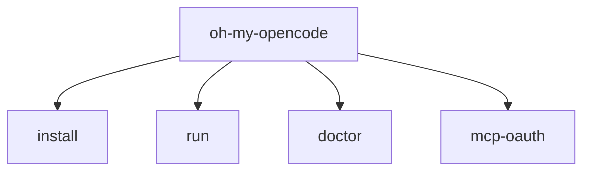

# 13장: CLI install, run, doctor

오마오는 OpenCode 안에서만 동작하지 않는다. CLI는 설치, 비대화형 실행, 진단을 제공한다. 플러그인을 제품으로 쓰려면 runtime hook만으로는 부족하고, 설치와 운영을 돕는 외곽 표면이 필요하다.

## 왜 중요한가

플러그인 사용자는 설정 파일을 직접 편집하는 데 익숙하지 않을 수 있다. CI나 automation에서는 TUI 없이 실행해야 할 수도 있다. 문제가 생겼을 때는 provider, model, binary, config 상태를 확인할 수 있어야 한다. CLI는 이 세 가지를 맡는다.

## 소스 앵커

- `src/cli/cli-program.ts`
- `src/cli/config-manager/`
- `src/cli/run/`
- `src/cli/doctor/`
- `src/cli/mcp-oauth/`
- `bin/oh-my-opencode.js`

## CLI 표면



## 핵심 메커니즘

`install`은 OpenCode config를 감지하고, plugin entry를 추가하고, 오마오 설정 파일을 생성한다. legacy 이름과 canonical 이름을 함께 고려해야 하므로 config manager가 별도 모듈로 존재한다.

`run`은 비대화형 세션을 다룬다. session resolver, server connection, event stream processor, output renderer, completion polling이 분리되어 있다. 이 구조는 "한 번 실행하고 결과 받기"가 사실은 여러 상태를 거치는 workflow임을 보여 준다.

`doctor`는 상태 점검 표면이다. formatter, runner, check 모듈이 나뉘어 있어 사람이 읽는 출력과 검사 로직을 분리한다.

## 트레이드오프

CLI가 강해질수록 플러그인과 제품의 경계가 흐려진다. 하지만 설치와 진단이 약하면 플러그인 자체의 채택 비용이 높아진다. 오마오는 runtime hook과 CLI를 분리하되 같은 설정 schema를 공유한다.

## 핵심 코드

`src/cli/run/runner.ts`의 비대화형 실행 핵심 경로다.

```ts
process.env.OPENCODE_CLI_RUN_MODE = "true"
process.env.OPENCODE_CLIENT = "run"

const pluginConfig = loadPluginConfig(directory, { command: "run" })
const resolvedAgent = resolveRunAgent(options, pluginConfig)
const resolvedModel = resolveRunModel(options.model)

const { client, cleanup: serverCleanup } = await createServerConnection({
  port: options.port,
  attach: options.attach,
  signal: abortController.signal,
})

const sessionID = await resolveSession({
  client,
  sessionId: options.sessionId,
  directory,
})

const events = await client.event.subscribe({ query: { directory } })
const eventState = createEventState()
const eventProcessor = processEvents(ctx, events.stream, eventState).catch(
  () => {},
)

await client.session.promptAsync({
  path: { id: sessionID },
  body: {
    agent: resolvedAgent,
    ...(resolvedModel ? { model: resolvedModel } : {}),
    tools: { question: false },
    parts: [{ type: "text", text: message }],
  },
  query: { directory },
})

const exitCode = await pollForCompletion(ctx, eventState, abortController)
```

## 소스 그라운딩

- `src/cli/cli-program.ts`는 `install`, `run`, `get-local-version`, `doctor`, `refresh-model-capabilities`, `version`, `mcp-oauth`를 commander subcommand로 등록한다.
- `run`은 `OPENCODE_CLI_RUN_MODE=true`와 `OPENCODE_CLIENT=run`을 설정한다. tool config handler는 이 값을 보고 question permission을 deny할 수 있다.
- `run()`은 `createServerConnection()`, `resolveSession()`, `client.event.subscribe()`, `processEvents()`, `promptAsync()`, `pollForCompletion()` 순서로 동작한다.
- `run`의 완료 기준은 일반 `opencode run`과 다르다. help text에 "todos completed/cancelled"와 "child sessions idle"까지 기다린다고 명시되어 있고, 실제로 `pollForCompletion()`이 event state를 본다.
- `doctor`는 `getAllCheckDefinitions()`, `gatherSystemInfo()`, `gatherToolsSummary()`를 30초 timeout 안에서 병렬 실행한다.
- `refresh-model-capabilities`는 config의 `model_capabilities.source_url`을 읽어 model capability cache를 갱신한다.

## 빌더에게 남는 것

플러그인을 배포할 계획이라면 CLI를 나중 문제로 미루지 말아야 한다. 설치, 실행, 진단은 기능이 아니라 사용자의 첫 실패를 줄이는 안전장치다.
