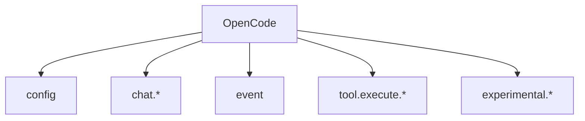

# 제3부: OpenCode 표면을 어떻게 플러그인으로 확장하는가

오마오는 서버를 직접 노출하는 앱이 아니라 OpenCode hook handler 묶음이다. 따라서 제품 표면은 라우트가 아니라 handler다. `config`가 에이전트와 MCP를 합성하고, `chat.message`가 첫 메시지와 키워드를 본다. `chat.params`는 모델 파라미터를 조정하고, `event`는 세션 생명주기를 운영 표면으로 바꾼다.

이 부는 `src/plugin/` 아래 파일을 중심으로 읽는다. 각 handler는 OpenCode가 플러그인에게 허용한 좁은 관문이고, 오마오는 그 관문을 기능별 런타임으로 확장한다.

## 핵심 소스

- `src/plugin-interface.ts`
- `src/plugin/config-handler.ts`
- `src/plugin/chat-message.ts`
- `src/plugin/chat-params.ts`
- `src/plugin/event.ts`
- `src/cli/`
