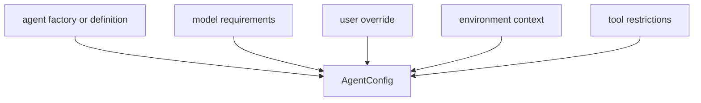

# 14장: 에이전트 확장 계약

오마오의 에이전트 확장은 prompt 파일을 추가하는 일보다 넓다. 에이전트는 모델 요구사항, 모드, 도구 권한, 카테고리, skill 가시성, 사용자 override를 함께 가진다.

## 왜 중요한가

플러그인에서 에이전트는 사용자에게 가장 잘 보이는 기능이다. 하지만 내부적으로는 가장 많은 정책이 걸린 객체이기도 하다. 잘못 설계하면 에이전트 이름은 많지만 실제로는 같은 모델과 같은 도구를 쓰는 중복 prompt 묶음이 된다.

## 소스 앵커

- `src/agents/types.ts`
- `src/agents/agent-builder.ts`
- `src/agents/builtin-agents.ts`
- `src/agents/builtin-agents/agent-overrides.ts`
- `src/features/claude-code-agent-loader/`
- `src/plugin-handlers/agent-config-handler.ts`

## 계약 구성



## 핵심 메커니즘

built-in agent는 factory pattern을 따른다. `createXXXAgent`는 모델과 category, git master config 같은 입력을 받아 AgentConfig를 만든다. 이 방식은 prompt를 코드에서 완전히 떼어내지는 않지만, 생성 시점의 정책을 명시할 수 있게 한다.

사용자 override는 agent config 위에 나중에 적용된다. model, prompt, tools, mode 같은 필드는 사용자 의도에 따라 바뀔 수 있다. 하지만 override가 모든 내부 보호를 무시하게 만들지는 않는다. agent override protection과 tool restriction 테스트가 이 경계를 지킨다.

Claude Code agent loader는 다른 생태계의 agent definition을 읽어 OpenCode agent config로 옮긴다. 여기서 중요한 것은 호환성을 "그냥 파일 읽기"로 보지 않는다는 점이다. 모델 이름 mapping, JSON agent, markdown definition, opencode config agent reader가 별도로 존재한다.

## 트레이드오프

에이전트 생성이 동적이면 사용자에게 유연하다. 대신 최종 agent 목록을 예측하려면 설정, provider cache, disabled list, external definitions를 모두 봐야 한다. 이 복잡성을 감수하는 이유는 플러그인이 다양한 팀 환경에 맞춰져야 하기 때문이다.

## 핵심 코드

`src/plugin-handlers/agent-config-handler.ts`는 여러 agent 출처를 하나의 custom summary로 합친 뒤 built-in agent 생성에 넘긴다.

```ts
const customAgentSummaries = [
  ...Object.entries(configAgent ?? {}),
  ...Object.entries(userAgents),
  ...Object.entries(projectAgents),
  ...Object.entries(opencodeGlobalAgents),
  ...Object.entries(opencodeProjectAgents),
  ...Object.entries(pluginAgents).filter(([, config]) => config !== undefined),
  ...Object.entries(agentDefinitionAgents),
  ...Object.entries(opencodeConfigAgents),
]
  .filter(([, config]) => config != null)
  .map(([name, config]) => ({
    name,
    description:
      typeof (config as Record<string, unknown>)?.description === "string"
        ? ((config as Record<string, unknown>).description as string)
        : "",
  }))

const builtinAgents = await createBuiltinAgents(
  migratedDisabledAgents,
  params.pluginConfig.agents,
  params.ctx.directory,
  currentModel,
  params.pluginConfig.categories,
  params.pluginConfig.git_master,
  allDiscoveredSkills,
  customAgentSummaries,
  browserProvider,
  currentModel,
  disabledSkills,
  useTaskSystem,
  disableOmoEnv,
)
```

## 소스 그라운딩

- `applyAgentConfig()`는 skill discovery를 먼저 수행한다. config source, user Claude skills, project Claude skills, project agents skills, opencode global/project skills, global agents skills가 모두 `allDiscoveredSkills`로 합쳐진다.
- agent source도 여러 층이다. user/project Claude agents, opencode global/project agents, plugin component agents, `agent_definitions`, opencode config agents, 기존 `config.agent`가 모두 custom summary에 들어간다.
- plugin component agent는 `migrateAgentConfig()`를 거치고 mode가 없으면 `subagent`로 보정된다.
- Sisyphus가 활성화된 경로에서는 Prometheus plan agent를 `buildPrometheusAgentConfig()`로 새로 만들고, `plan` agent는 `buildPlanDemoteConfig()`로 demote될 수 있다.
- 최종 agent config는 `remapAgentKeysToDisplayNames()`와 `reorderAgentsByPriority()`를 지난 뒤 모든 agent name을 `registerAgentName()`에 등록한다.

## 빌더에게 남는 것

에이전트 확장은 이름과 prompt가 아니라 policy object다. 모델 요구사항, 도구 권한, override 규칙, 외부 definition 변환을 함께 설계해야 agent 수가 늘어도 시스템이 설명 가능하다.
