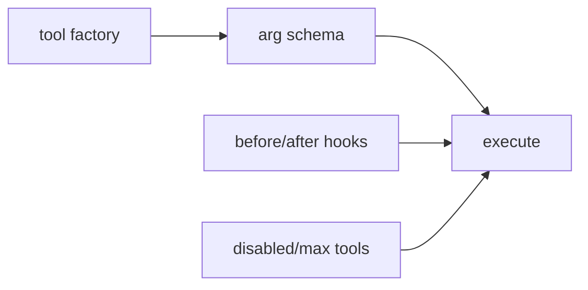

# 15장: 도구 확장 계약

도구는 모델이 실제 환경을 바꾸는 경계다. 오마오는 LSP, grep, glob, AST grep, background task, skill, skill MCP, session manager, task system, hashline edit를 tool registry로 합성한다.

## 왜 중요한가

도구는 많을수록 좋아 보이지만, 모델에게는 선택 비용이 된다. 또한 tool schema가 불안정하면 provider별 호출에서 실패한다. 오마오는 도구를 factory로 만들고, registry에서 정규화하고, disabled list와 max tool cap으로 줄일 수 있게 한다.

## 소스 앵커

- `src/tools/index.ts`
- `src/plugin/tool-registry.ts`
- `src/plugin/normalize-tool-arg-schemas.ts`
- `src/tools/shared/`
- `src/shared/disabled-tools`
- `src/tools/session-manager/`

## 도구 계약



## 핵심 메커니즘

registry는 모든 도구를 한 번 모은 뒤 `normalizeToolArgSchemas`를 적용한다. 이 단계는 도구 authoring 스타일이 달라도 OpenCode가 소비할 수 있는 형태로 맞춘다.

도구 실행 자체는 hook과 함께 읽어야 한다. 예를 들어 file write guard는 도구 실행 전 위험을 막고, hashline read enhancer는 Read 결과를 edit 가능한 형태로 바꾼다. 즉 도구 계약은 tool definition만이 아니라 before/after hook까지 포함한다.

`experimental.max_tools`는 provider나 모델 제약에 대응하기 위한 장치다. low priority order에 따라 도구를 제거하므로, 무작위로 잘리지 않는다. 이 설계는 도구 수가 늘어난 플러그인에서 특히 중요하다.

## 트레이드오프

도구를 많이 제공하면 agent 능력은 커진다. 그러나 tool 목록이 길어질수록 모델이 엉뚱한 도구를 고를 수 있다. 오마오는 agent별 prompt, category, disabled_tools, max_tools를 통해 이 문제를 완화한다.

## 핵심 코드

`src/plugin-handlers/tool-config-handler.ts`는 host config와 agent별 permission을 직접 rewrite한다.

```ts
params.config.tools = {
  ...(params.config.tools as Record<string, unknown>),
  "grep_app_*": false,
  LspHover: false,
  LspCodeActions: false,
  LspCodeActionResolve: false,
  "task_*": false,
  teammate: false,
  ...(taskSystemEnabled ? { todowrite: false, todoread: false } : {}),
  ...(skillDeniedByHost ? { skill: false, skill_mcp: false } : {}),
}

const sisyphus = agentByKey(params.agentResult, "sisyphus")
if (sisyphus) {
  sisyphus.permission = {
    ...sisyphus.permission,
    call_omo_agent: "deny",
    task: "allow",
    question: questionPermission,
    "task_*": "allow",
    teammate: "allow",
    ...denyTodoTools,
  }
}

params.config.permission = {
  webfetch: "allow",
  external_directory: "allow",
  ...(params.config.permission as Record<string, unknown>),
  task: "deny",
}
```

## 소스 그라운딩

- `applyToolConfig()`는 OpenCode config의 `tools`에 `"grep_app_*": false`, `LspHover: false`, `LspCodeActions: false`, `task_*: false`, `teammate: false`를 기본으로 넣는다.
- host config에서 `permission.skill === "deny"`면 `skill`과 `skill_mcp` 도구도 꺼진다. 플러그인 도구가 host permission을 거스르지 않는다.
- CLI run mode에서는 `question` permission이 deny된다. `OPENCODE_CLI_RUN_MODE`가 tool permission으로 흘러간다.
- Librarian은 `"grep_app_*": "allow"`를 받는다. 반대로 multimodal-looker는 `task`와 `look_at`을 deny한다. agent별 도구 권한이 다르게 보정된다.
- Sisyphus, Hephaestus, Prometheus, Atlas, Sisyphus Junior는 `task`, `task_*`, `teammate`, `question` 권한이 각각 다르게 설정된다.
- 최종 `config.permission`에는 `webfetch: "allow"`, `external_directory: "allow"`, `task: "deny"`가 들어간다. native task permission은 기본 deny로 두고 agent별로 다시 열어 준다.

## 빌더에게 남는 것

새 도구를 만들 때는 실행 함수보다 먼저 표면을 정의해야 한다. 이름, schema, 실패 메시지, hook guard, 비활성화 방식, agent 노출 범위를 함께 정해야 한다.
