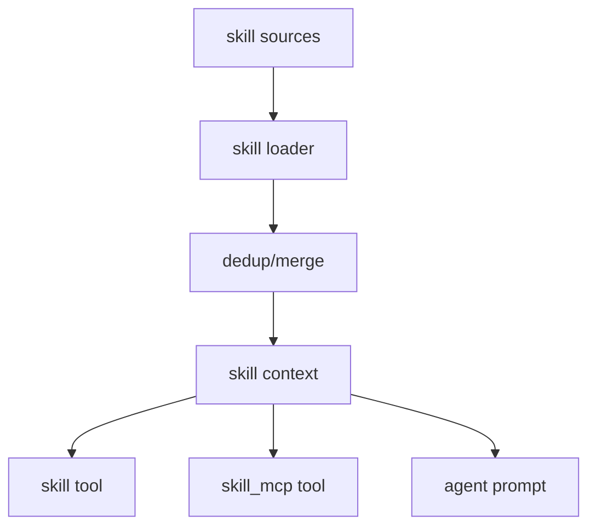

# 16장: 스킬을 지식 계층으로 다루기

오마오에서 스킬은 도구도 아니고 에이전트도 아니다. 스킬은 에이전트가 사용할 수 있는 지식, 절차, 그리고 때로는 embedded MCP 설정을 가진 계층이다.

## 왜 중요한가

모든 지식을 prompt에 넣으면 prompt가 비대해진다. 모든 기능을 tool로 만들면 실행 표면이 커진다. 스킬은 그 사이에 있다. 필요할 때 읽고, agent 가시성에 따라 노출하고, MCP가 있으면 세션 단위로 연결한다.

## 소스 앵커

- `src/features/opencode-skill-loader/`
- `src/features/builtin-skills/`
- `src/plugin/skill-context.ts`
- `src/tools/skill/`
- `src/tools/skill-mcp/`
- `src/hooks/category-skill-reminder/`

## 스킬 흐름



## 핵심 메커니즘

`createSkillContext`는 directory와 plugin config를 기준으로 스킬을 발견한다. built-in skill, external skill, Claude Code plugin skill이 섞일 수 있으므로 deduplication과 disabled skill 처리가 필요하다.

`skill` tool은 스킬 본문과 template을 모델이 사용할 수 있게 한다. `skill_mcp` tool은 스킬 안에 들어 있는 MCP 서버를 session 단위로 호출한다. 이 둘을 나눈 이유는 지식 retrieval과 외부 capability 호출이 다른 책임이기 때문이다.

`category-skill-reminder`는 category와 skill을 연결해 모델이 적절한 시점에 스킬을 떠올리도록 돕는다. 스킬은 단순 파일 목록이 아니라 라우팅과 prompt 설계에 참여한다.

## 트레이드오프

스킬은 prompt 비대화를 줄이지만 discovery와 merge 비용을 만든다. 또한 스킬이 MCP를 포함하면 connection lifetime까지 고려해야 한다. 그래서 skill loader와 skill MCP manager가 분리되어 있다.

## 핵심 코드

`src/plugin/skill-context.ts`는 built-in, config source, Claude, OpenCode, `.agents` 스킬을 merge한다.

```ts
const builtinSkills = createBuiltinSkills({
  browserProvider,
  disabledSkills,
}).filter((skill) => {
  if (skill.mcpConfig) {
    for (const mcpName of Object.keys(skill.mcpConfig)) {
      if (systemMcpNames.has(mcpName)) return false
    }
  }
  return true
})

const includeClaudeSkills = pluginConfig.claude_code?.skills !== false
const [
  configSourceSkills,
  userSkills,
  globalSkills,
  projectSkills,
  opencodeProjectSkills,
  agentsProjectSkills,
  agentsGlobalSkills,
] = await Promise.all([
  discoverConfigSourceSkills({ config: pluginConfig.skills, configDir: directory }),
  includeClaudeSkills ? discoverUserClaudeSkills() : Promise.resolve([]),
  discoverOpencodeGlobalSkills(),
  includeClaudeSkills ? discoverProjectClaudeSkills(directory) : Promise.resolve([]),
  discoverOpencodeProjectSkills(directory),
  discoverProjectAgentsSkills(directory),
  discoverGlobalAgentsSkills(),
])

const mergedSkills = mergeSkills(
  builtinSkills,
  pluginConfig.skills,
  filteredConfigSourceSkills,
  [...filteredUserSkills, ...filteredAgentsGlobalSkills],
  filteredGlobalSkills,
  [...filteredProjectSkills, ...filteredAgentsProjectSkills],
  filteredOpencodeProjectSkills,
  { configDir: directory },
)
```

## 소스 그라운딩

- `createBuiltinSkills()`는 browser provider에 따라 `playwright`, `agent-browser`, `playwright-cli` 중 하나만 browser skill로 선택한다.
- built-in skill 목록은 browser skill, `frontend-ui-ux`, `git-master`, `dev-browser`, `review-work`, `ai-slop-remover`다. `disabledSkills` set에 있으면 제외된다.
- `createSkillContext()`는 system MCP server names와 충돌하는 built-in skill MCP를 제외한다. skill embedded MCP가 전역 MCP와 이름 충돌을 만들지 않게 한다.
- skill discovery 우선순위는 config source, Claude user/project, opencode global/project, `.agents` project/global까지 포함한다. 이후 `mergeSkills()`가 중복 이름을 정리한다.
- provider-gated skill은 `agent-browser`와 `playwright`다. browser provider 설정과 맞지 않는 skill은 필터링된다.
- `createSkillTool()`은 skill을 찾으면 `ctx.ask({ permission: "skill", patterns: [...] })`를 호출하고, skill에 agent restriction이 있으면 현재 agent와 맞는지 검사한다.

## 빌더에게 남는 것

지식, 절차, 외부 capability를 모두 tool로 만들지 말아야 한다. 읽기 중심 지식은 skill, 실행 능력은 tool, 외부 protocol은 MCP로 나누면 시스템이 오래 버틴다.
