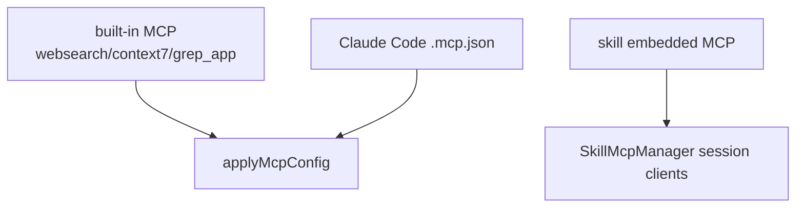

# 17장: 3계층 MCP와 OAuth

오마오는 MCP를 세 계층으로 다룬다. built-in remote MCP, Claude Code `.mcp.json`, skill-embedded MCP다. 같은 MCP라는 이름을 쓰지만 출처와 생명주기가 다르다.

## 왜 중요한가

MCP는 외부 도구 생태계와 연결되는 강력한 경계다. 하지만 여러 출처를 무작정 합치면 이름 충돌, env 노출, OAuth 갱신, session cleanup 문제가 생긴다. 오마오는 MCP 출처를 분리하고 최종 OpenCode config에서 합친다.

## 소스 앵커

- `src/mcp/index.ts`
- `src/features/claude-code-mcp-loader/`
- `src/features/skill-mcp-manager/`
- `src/features/mcp-oauth/`
- `src/plugin-handlers/mcp-config-handler.ts`
- `src/tools/skill-mcp/`

## 3계층 구조



## 핵심 메커니즘

`createBuiltinMcps`는 `websearch`, `context7`, `grep_app`을 remote MCP로 만든다. `disabled_mcps`에 있으면 제외한다. `websearch`는 config에 따라 생성 여부가 달라질 수 있다.

Claude Code `.mcp.json`은 loader가 읽고 OpenCode SDK 형식으로 변환한다. `${VAR}` env expansion은 allowlist를 통과해야 한다. 사용자 config가 같은 이름의 MCP를 갖고 있으면 warning을 남긴다.

skill-embedded MCP는 전역 config에 곧장 합치지 않는다. `SkillMcpManager`가 sessionID, skillName, serverName을 key로 client를 관리한다. OAuth step-up, post-request auth refresh, reconnect retry도 이 계층에 있다.

## 트레이드오프

MCP를 세 계층으로 나누면 구현은 복잡하다. 대신 충돌과 lifetime이 명확해진다. built-in MCP는 플러그인 기본 능력, `.mcp.json`은 사용자/프로젝트 통합, skill MCP는 특정 지식 계층의 실행 능력으로 읽힌다.

## 핵심 코드

`src/plugin-handlers/mcp-config-handler.ts`의 MCP merge 순서다.

```ts
const mcpResult = params.pluginConfig.claude_code?.mcp ?? true
  ? await loadMcpConfigs(disabledMcps)
  : { servers: {} }

const merged = {
  ...createBuiltinMcps(disabledMcps, params.pluginConfig),
  ...mcpResult.servers,
  ...(userMcp ?? {}),
  ...params.pluginComponents.mcpServers,
} as Record<string, McpEntry>

for (const name of userDisabledMcps) {
  if (merged[name]) {
    merged[name] = { ...merged[name], enabled: false }
  }
}

const disabledSet = new Set(disabledMcps)
for (const name of disabledSet) {
  delete merged[name]
}

params.config.mcp = merged
```

`src/tools/skill-mcp/tools.ts`는 skill MCP operation을 정확히 하나만 허용한다.

```ts
const operations: OperationType[] = []
if (args.tool_name) operations.push({ type: "tool", name: args.tool_name })
if (args.resource_name) operations.push({ type: "resource", name: args.resource_name })
if (args.prompt_name) operations.push({ type: "prompt", name: args.prompt_name })

if (operations.length === 0) {
  throw new Error("Missing operation. Exactly one of tool_name, resource_name, or prompt_name must be specified.")
}

if (operations.length > 1) {
  throw new Error("Multiple operations specified. Exactly one of tool_name, resource_name, or prompt_name must be provided.")
}
```

## 소스 그라운딩

- `createBuiltinMcps()`는 disabled list를 확인한 뒤 `websearch`, `context7`, `grep_app`만 만든다. built-in MCP 목록은 코드상 세 개로 제한된다.
- `applyMcpConfig()`는 user config에서 `enabled: false`인 MCP 이름을 먼저 capture한다. merge 후에도 이 disable 의도를 다시 적용한다.
- Claude Code MCP loading은 `pluginConfig.claude_code?.mcp ?? true`일 때만 수행된다.
- merge 순서는 built-in MCP, Claude Code `.mcp.json`, user MCP, plugin component MCP다. 뒤쪽 항목이 앞쪽 이름을 덮을 수 있다.
- `createSkillMcpTool()`은 `tool_name`, `resource_name`, `prompt_name` 중 정확히 하나만 허용한다. 여러 operation을 한 호출에 넣으면 에러를 던진다.
- skill MCP에서 built-in MCP 이름을 요청하면 `formatBuiltinMcpHint()`가 native tool을 쓰라는 hint를 반환한다. 전역 MCP와 skill MCP를 의도적으로 구분한다.
- `SkillMcpManager`는 `sessionID:skillName:serverName`을 client key로 쓴다. session cleanup 시 `disconnectSession()`으로 연결을 끊을 수 있다.

## 빌더에게 남는 것

MCP는 "서버 목록"으로만 설계하면 부족하다. 출처, env 정책, 인증, session lifetime, 충돌 우선순위를 먼저 정해야 한다.
