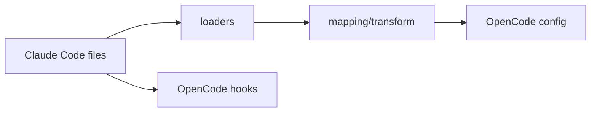

# 18장: Claude Code 호환성 브리지

오마오는 OpenCode 플러그인이지만 Claude Code 생태계를 적극적으로 읽는다. agent definition, command, MCP, hook, session state 일부를 OpenCode 쪽으로 옮긴다. 이 장의 핵심은 호환성을 기능 복제가 아니라 변환 계층으로 보는 것이다.

## 왜 중요한가

사용자는 이미 Claude Code용 `.claude`, command, agent, MCP 설정을 갖고 있을 수 있다. OpenCode로 넘어올 때 그 자산을 버리게 하면 채택 비용이 커진다. 반대로 무조건 가져오면 OpenCode native 기능과 충돌한다.

## 소스 앵커

- `src/features/claude-code-agent-loader/`
- `src/features/claude-code-command-loader/`
- `src/features/claude-code-mcp-loader/`
- `src/features/claude-code-plugin-loader/`
- `src/features/claude-code-session-state/`
- `src/hooks/claude-code-hooks/`

## 호환성 흐름



## 핵심 메커니즘

agent loader는 markdown과 JSON definition을 읽고, 모델 mapping을 적용한다. command loader는 slash command template을 OpenCode command 구성으로 변환한다. MCP loader는 `.mcp.json` 형식과 env expansion을 처리한다.

Claude Code hooks는 OpenCode의 transform과 tool lifecycle에 연결된다. 하지만 모든 hook을 항상 켜지는 않는다. `claude_code.hooks` 설정과 disabled hook 목록이 적용된다.

호환성 충돌 감지도 있다. 외부 skill plugin이나 notification plugin이 감지되면 warning을 보여 준다. 오마오가 같은 역할을 제공하는 경우 중복 실행을 피해야 하기 때문이다.

## 트레이드오프

호환성 브리지는 채택 비용을 낮춘다. 대신 두 생태계의 의미 차이를 계속 추적해야 한다. OpenCode native가 기능을 제공하기 시작하면 오마오 쪽 hook을 자동 비활성화하는 코드가 필요한 것도 이 때문이다.

## 핵심 코드

`src/plugin-handlers/plugin-components-loader.ts`는 Claude Code plugin loading을 timeout으로 감싼다.

```ts
export async function loadPluginComponents(params: {
  pluginConfig: OhMyOpenCodeConfig;
}): Promise<PluginComponents> {
  const pluginsEnabled = params.pluginConfig.claude_code?.plugins ?? true
  if (!pluginsEnabled) {
    return EMPTY_PLUGIN_COMPONENTS
  }

  const timeoutMs =
    params.pluginConfig.experimental?.plugin_load_timeout_ms ?? 10000

  try {
    let timeoutId: ReturnType<typeof setTimeout> | undefined
    const timeoutPromise = new Promise<never>((_, reject) => {
      timeoutId = setTimeout(
        () => reject(new Error(`Plugin loading timed out after ${timeoutMs}ms`)),
        timeoutMs,
      )
    })

    const pluginComponents = (await Promise.race([
      loadAllPluginComponents({
        enabledPluginsOverride:
          params.pluginConfig.claude_code?.plugins_override,
      }),
      timeoutPromise,
    ]).finally(() => {
      if (timeoutId) clearTimeout(timeoutId)
    })) as PluginComponents

    return pluginComponents
  } catch (error) {
    addConfigLoadError({ path: "plugin-loading", error: String(error) })
    return EMPTY_PLUGIN_COMPONENTS
  }
}
```

## 소스 그라운딩

- `loadPluginComponents()`는 `loadAllPluginComponents()`를 호출해 commands, skills, agents, MCP servers, hook configs를 한 번에 수집한다.
- Claude Code plugin loading은 `claude_code.plugins`가 false면 완전히 비활성화된다. `plugins_override`는 enabled plugin 목록을 강제로 조정한다.
- agent loader는 `loadUserAgents()`, `loadProjectAgents()`, `loadOpencodeGlobalAgents()`, `loadOpencodeProjectAgents()`, `loadAgentDefinitions()`, `readOpencodeConfigAgents()`로 출처를 분리한다.
- `mapClaudeModelToOpenCode()`는 Claude Code model alias를 OpenCode provider/model 문자열로 옮기는 전용 모듈이다.
- `createClaudeCodeHooksHook()`는 `claude_code.hooks`가 false면 hook 실행을 막고, keyword detector disabled 상태도 전달받는다.
- `discoverCommandsSync()`는 slash command discovery에서 Claude Code plugin enabled 여부와 override를 함께 본다.

## 빌더에게 남는 것

다른 도구와 호환되려면 파일을 읽는 것보다 의미를 번역해야 한다. 그리고 번역 계층에는 충돌 감지와 끄는 스위치가 반드시 있어야 한다.
