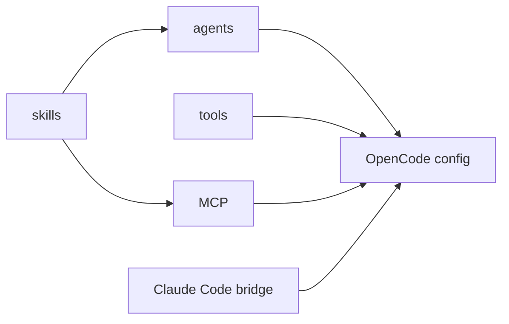

# 제4부: 확장을 어떻게 계약으로 나누는가

에이전트, 도구, 스킬, MCP, slash command는 모두 "확장"이라고 부를 수 있다. 하지만 같은 인터페이스로 다루면 금방 망가진다. 에이전트는 행동 주체이고, 도구는 실행 표면이며, 스킬은 지식 계층이다. MCP는 외부 능력의 프로토콜이고, Claude Code 호환성은 다른 생태계의 설정과 파일 규칙을 OpenCode 쪽으로 번역하는 문제다.

이 부는 오마오가 확장을 한 바구니에 넣지 않는 방식을 읽는다. 같은 사용자 경험으로 보이는 기능도 내부 계약은 서로 다르다.

## 핵심 소스

- `src/agents/`
- `src/tools/`
- `src/features/opencode-skill-loader/`
- `src/features/skill-mcp-manager/`
- `src/features/claude-code-*`
- `src/mcp/`
