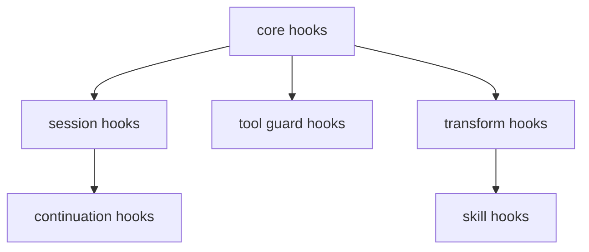

# 19장: 훅 티어와 guardrail 아키텍처

오마오의 훅은 많다. 하지만 무작위 목록이 아니다. session, tool guard, transform, continuation, skill 계층으로 나뉘고, 각 계층은 서로 다른 실패 비용을 다룬다.

## 왜 중요한가

훅이 많아질수록 실행 순서와 책임이 중요해진다. 어떤 훅은 모델 호출 전 상태를 바꾸고, 어떤 훅은 도구 실행 전 위험을 막으며, 어떤 훅은 도구 실행 후 출력을 다듬는다. 이 구분이 없으면 작은 기능 하나가 전체 채팅 경로를 불안정하게 만든다.

## 소스 앵커

- `src/create-hooks.ts`
- `src/plugin/hooks/create-core-hooks.ts`
- `src/plugin/hooks/create-session-hooks.ts`
- `src/plugin/hooks/create-tool-guard-hooks.ts`
- `src/plugin/hooks/create-transform-hooks.ts`
- `src/plugin/hooks/create-continuation-hooks.ts`
- `src/plugin/hooks/create-skill-hooks.ts`

## 훅 티어



## 핵심 메커니즘

`createHooks`는 core, continuation, skill 훅을 만든 뒤 spread로 합친다. core 내부는 다시 session, tool guard, transform으로 나뉜다. 훅 계층은 실제 파일 구조로 드러난다.

`safeCreateHook`은 훅 생성 실패가 전체 플러그인 로딩을 망가뜨리지 않도록 돕는다. 설정의 `experimental.safe_hook_creation`은 이 동작을 제어한다. 큰 플러그인에서는 훅 하나의 실패와 전체 로딩 실패를 구분해야 한다.

disabled hook 목록은 `src/index.ts`에서 set으로 만들어지고, 모든 hook factory에 전달된다. 사용자가 특정 guardrail이나 feature를 끄는 방식이 한곳에서 시작되는 셈이다.

## guardrail의 의미

guardrail은 단순 차단이 아니다. `write-existing-file-guard`는 위험한 write를 막고, `comment-checker`는 코드 품질 규칙을 확인하며, `tool-output-truncator`는 모델 context를 보호한다. `thinking-block-validator`와 `tool-pair-validator`는 메시지 구조 자체를 검증한다.

## 핵심 코드

`src/create-hooks.ts`는 core, continuation, skill hook을 합치는 실제 조립기다.

```ts
const core = createCoreHooks({
  ctx,
  pluginConfig,
  modelCacheState,
  modelFallbackControllerAccessor,
  isHookEnabled,
  safeHookEnabled,
})

const continuation = createContinuationHooks({
  ctx,
  pluginConfig,
  isHookEnabled,
  safeHookEnabled,
  backgroundManager,
  sessionRecovery: core.sessionRecovery,
})

const skill = createSkillHooks({
  ctx,
  pluginConfig,
  isHookEnabled,
  safeHookEnabled,
  mergedSkills,
  availableSkills,
})

const hooks = {
  ...core,
  ...continuation,
  ...skill,
}
```

## 소스 그라운딩

- `HookNameSchema`는 실제 disabled hook 이름의 source of truth다. 52개 hook name이 여기에 열거된다.
- session hook factory는 `context-window-monitor`, `session-recovery`, `session-notification`, `think-mode`, `model-fallback`, `runtime-fallback`, `legacy-plugin-toast` 같은 lifecycle hook을 만든다.
- tool guard hook factory는 `comment-checker`, `tool-output-truncator`, `rules-injector`, `write-existing-file-guard`, `bash-file-read-guard`, `hashline-read-enhancer`, `webfetch-redirect-guard`를 만든다.
- transform hook factory는 `claude-code-hooks`, `keyword-detector`, `contextInjectorMessagesTransform`, `thinking-block-validator`, `tool-pair-validator`를 만든다.
- continuation hook factory는 `stop-continuation-guard`, `compaction-context-injector`, `todo-continuation-enforcer`, `unstable-agent-babysitter`, `background-notification`, `atlas`를 만든다.
- `safeCreateHook(hookName, factory, { enabled: safeHookEnabled })`는 hook 생성 실패가 plugin load 실패로 번지지 않도록 하는 공통 래퍼다.

## 빌더에게 남는 것

훅을 추가하기 전에 tier를 정해야 한다. session, tool-before, tool-after, message-transform, compaction, skill 중 어디에 속하는지 말할 수 없으면 아직 설계가 부족한 것이다.
