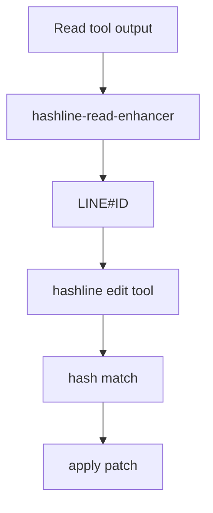

# 20장: Hashline edit와 파일 수정 의미론

Hashline edit는 파일 수정의 기준을 line number에서 content hash가 붙은 line identity로 옮긴다. Read 출력에 `LINE#ID`를 붙이고, edit는 이 ID가 맞을 때만 적용되도록 한다.

## 왜 중요한가

라인 번호만 믿는 edit는 동시 변경과 stale context에 약하다. 모델이 파일을 읽은 뒤 다른 변경이 들어오면 같은 line number가 다른 내용을 가리킬 수 있다. Hashline은 이 위험을 줄인다.

## 소스 앵커

- `src/tools/hashline-edit/`
- `src/hooks/hashline-read-enhancer/`
- `src/hooks/hashline-edit-diff-enhancer/`
- `src/plugin/tool-registry.ts`
- `src/plugin-handlers/config-handler.ts`

## 흐름



## 핵심 메커니즘

`hashline_edit` 설정이 켜지면 registry는 기본 edit 대신 hashline edit tool을 등록한다. 동시에 read enhancer hook은 파일 읽기 결과에 hashline 정보를 추가한다. 도구와 hook이 함께 켜져야 의미론이 완성된다.

Hashline의 핵심은 "모델이 본 내용"과 "수정하려는 내용"을 연결하는 것이다. 모델은 line number만이 아니라 content hash 기반 ID를 제출해야 한다. mismatch가 나면 수정은 거절된다.

`clearFormatterCache`가 config handler에서 호출되는 점도 관련이 있다. 파일 수정 도구는 formatter와 연결될 수 있으므로, 설정 변경 시 formatter 상태를 정리해야 한다.

## 트레이드오프

Hashline은 안전성을 높이지만 모델에게 더 엄격한 입력 형식을 요구한다. prompt와 read output이 이 규칙을 충분히 설명하지 못하면 edit 실패가 늘어난다. 그래서 enhancer와 diff enhancer가 함께 필요하다.

## 핵심 코드

`src/hooks/hashline-read-enhancer/hook.ts`는 Read 출력을 `LINE#ID` 형식으로 바꾼다.

```ts
function transformLine(line: string): string {
  const parsed = parseReadLine(line)
  if (!parsed) {
    return line
  }
  if (parsed.content.endsWith(OPENCODE_LINE_TRUNCATION_SUFFIX)) {
    return line
  }
  const hash = computeLineHash(parsed.lineNumber, parsed.content)
  return `${parsed.lineNumber}#${hash}|${parsed.content}`
}
```

`src/tools/hashline-edit/validation.ts`는 stale read를 mismatch error로 바꾼다.

```ts
export function validateLineRefs(lines: string[], refs: string[]): void {
  const mismatches: HashMismatch[] = []

  for (const ref of refs) {
    const { line, hash } = parseLineRefWithHint(ref, lines)

    if (line < 1 || line > lines.length) {
      throw new Error(`Line number ${line} out of bounds (file has ${lines.length} lines)`)
    }

    const content = lines[line - 1]
    if (!isCompatibleLineHash(line, content, hash)) {
      mismatches.push({ line, expected: hash })
    }
  }

  if (mismatches.length > 0) {
    throw new HashlineMismatchError(mismatches, lines)
  }
}
```

## 소스 그라운딩

- `createHashlineEditTool()`의 args는 `filePath`, `delete`, `rename`, `edits`다. edit operation은 `replace`, `append`, `prepend` 중 하나다.
- `computeLineHash()`는 `content.replace(/\r/g, "").trimEnd()`를 normalize한 뒤 `Bun.hash.xxHash32`와 256개 dictionary를 사용해 2글자 hash를 만든다.
- `formatHashLine()`은 `${lineNumber}#${hash}|${content}` 형태를 출력한다. Read output이 이 형식을 따라야 edit anchor가 된다.
- `createHashlineReadEnhancerHook()`은 tool name이 `Read`일 때만 output을 변환하고, `Write` 성공 출력은 `File written successfully. N lines written.` 형태로 보정한다.
- OpenCode Read output이 `123: ...` 또는 `123| ...` 형식일 때만 hashline 변환을 수행한다. truncation suffix가 붙은 줄은 hash를 붙이지 않는다.
- `validateLineRefs()`는 여러 ref를 한 번에 검증하고 mismatch가 있으면 `HashlineMismatchError`를 던진다. 에러 메시지는 주변 2줄 context와 새 hashline을 함께 보여 준다.

## 빌더에게 남는 것

파일 수정 도구는 "텍스트를 바꾼다"보다 더 정확한 의미론을 가져야 한다. stale read, formatting, diff 설명, 실패 메시지를 설계하지 않으면 작은 edit가 큰 손상으로 이어진다.
