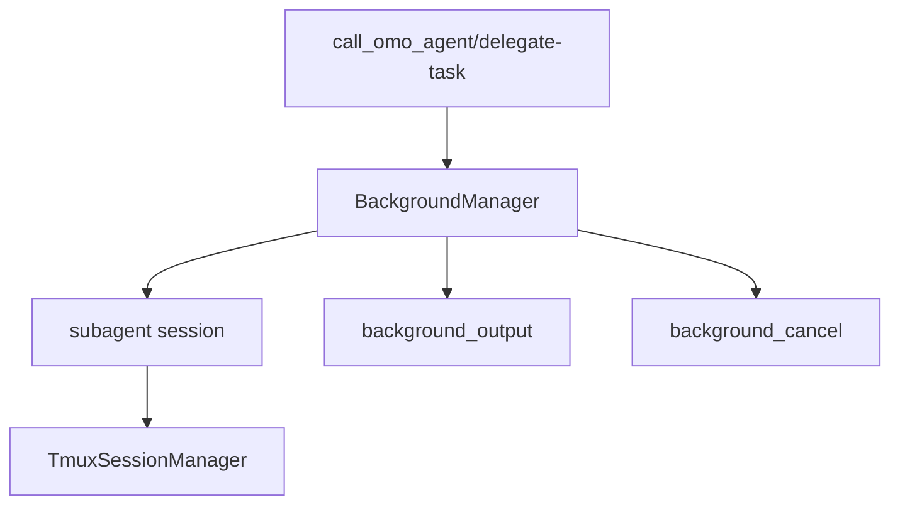

# 21장: 백그라운드 에이전트와 tmux 격리

오마오의 background agent는 긴 작업을 메인 채팅 루프 밖에서 실행하기 위한 장치다. tmux 통합은 이 실행을 사용자가 관찰하고 복구할 수 있는 세션 표면으로 만든다.

## 왜 중요한가

멀티 에이전트 시스템에서 하위 작업은 오래 걸릴 수 있다. 메인 세션이 모든 출력을 기다리면 사용자 경험이 막힌다. 반대로 완전히 분리하면 진행 상황과 결과를 잃는다. background manager와 tmux manager는 이 둘 사이를 잇는다.

## 소스 앵커

- `src/features/background-agent/`
- `src/features/tmux-subagent/`
- `src/tools/background-task/`
- `src/tools/call-omo-agent/`
- `src/tools/delegate-task/`
- `src/create-runtime-tmux-config.ts`

## 실행 흐름



## 핵심 메커니즘

`createManagers`에서 BackgroundManager는 tmuxConfig와 callback을 받는다. subagent session이 만들어지면 tmux manager에 session.created 이벤트를 전달한다. 이후 task toast와 parent notification 경로가 작업 상태를 보여 준다.

background 도구는 output과 cancel로 나뉜다. 실행을 시작하는 도구와 상태를 보는 도구, 중단하는 도구를 분리해야 모델과 사용자가 장기 작업을 통제할 수 있다.

tmux 통합이 켜져 있으면 interactive bash session hook도 활성화될 수 있다. 이는 단순 shell 실행이 아니라 세션과 pane을 연결하는 운영 표면이다.

## 트레이드오프

tmux는 관찰성과 격리를 제공하지만 환경 의존성을 만든다. 오마오는 tmux config를 별도로 만들고, enabled 여부에 따라 manager와 hook 동작을 조정한다. 기능을 강제하지 않고 runtime capability로 다룬다.

## 핵심 코드

`src/features/background-agent/manager.ts`의 `launch()`는 task를 즉시 `pending`으로 만들고 queue에 넣는다.

```ts
const task: BackgroundTask = {
  id: `bg_${crypto.randomUUID().slice(0, 8)}`,
  status: "pending",
  queuedAt: new Date(),
  rootSessionID: spawnReservation.spawnContext.rootSessionID,
  description: input.description,
  prompt: input.prompt,
  agent: input.agent,
  spawnDepth: spawnReservation.spawnContext.childDepth,
  parentSessionID: input.parentSessionID,
  parentMessageID: input.parentMessageID,
  parentModel: input.parentModel,
  parentAgent: input.parentAgent,
  parentTools: input.parentTools,
  model: input.model,
  fallbackChain: input.fallbackChain,
  attemptCount: 0,
  category: input.category,
}

this.tasks.set(task.id, task)
this.taskHistory.record(input.parentSessionID, {
  id: task.id,
  agent: input.agent,
  description: input.description,
  status: "pending",
  category: input.category,
})

const key = this.getConcurrencyKeyFromInput(input)
const queue = this.queuesByKey.get(key) ?? []
queue.push({ task, input })
this.queuesByKey.set(key, queue)

void this.processKey(key)
return { ...task }
```

## 소스 그라운딩

- `BackgroundTaskStatus`는 `pending`, `running`, `completed`, `error`, `cancelled`, `interrupt`다. background 작업은 문자열 로그가 아니라 명시 상태를 가진다.
- `BackgroundTask`에는 `rootSessionID`, `parentSessionID`, `parentMessageID`, `spawnDepth`, `fallbackChain`, `attemptCount`, `concurrencyKey`, `category`가 저장된다.
- `BackgroundManager.launch()`는 먼저 `reserveSubagentSpawn()`으로 depth/descendant 제한을 확인한 뒤 task를 `pending`으로 만들고 queue에 넣는다.
- `ConcurrencyManager.getConcurrencyLimit()`은 model-specific, provider-specific, default 순서로 limit을 찾고 기본값은 5다. 설정값 0은 Infinity로 처리된다.
- `startTask()`는 parent session의 directory를 가져오고, `client.session.create({ parentID })`로 subagent session을 만든다.
- tmux callback은 `tmuxEnabled && isInsideTmux()`일 때만 호출된다. tmux 설정만 켜져 있어도 실제 tmux 안이 아니면 pane spawn을 건너뛴다.
- prompt body는 `task: false`, `call_omo_agent: true`, `question: false`를 기본 tool policy로 넣고 agent별 restriction을 합친다.

## 빌더에게 남는 것

긴 작업은 별도 실행 경로, 상태 조회 도구, 취소 도구, 관찰 표면을 함께 필요로 한다. spawn만 만들면 운영 기능이 아니다.
