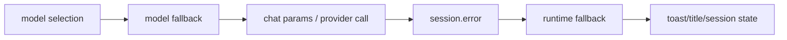

# 22장: 모델 fallback과 runtime fallback

오마오에는 fallback이 두 종류 있다. model fallback은 모델 선택과 API 오류에 선제적으로 대응하고, runtime fallback은 session error를 보고 반응한다. 둘을 나눈 것이 이 장의 핵심이다.

## 왜 중요한가

모델 실패는 한 가지가 아니다. 선택한 모델이 없을 수 있고, provider가 특정 파라미터를 거부할 수 있으며, 세션 실행 중 오류가 날 수도 있다. 같은 retry로 모두 처리하면 잘못된 복구가 일어난다.

## 소스 앵커

- `src/hooks/model-fallback/`
- `src/hooks/runtime-fallback/`
- `src/shared/model-requirements.ts`
- `src/shared/model-capabilities/`
- `src/cli/doctor/checks/model-resolution*`
- `src/config/schema/runtime-fallback.ts`

## fallback 분리



## 핵심 메커니즘

model fallback hook은 설정에서 켜야 활성화된다. fallback title을 켜면 적용된 provider/model 정보를 session title에 표시할 수 있다. 이 기능은 사용자가 "왜 다른 모델로 답하고 있는지"를 볼 수 있게 한다.

runtime fallback은 `runtime_fallback` 설정을 boolean 또는 객체로 받는다. retry 대상 error code, timeout 같은 고급 설정을 가질 수 있다. 이 hook은 event 계층에서 session error를 다룬다.

모델 해상도는 agent 생성과도 연결된다. 각 agent는 model requirement와 fallback chain을 가질 수 있고, available model cache를 기준으로 선택된다.

## 트레이드오프

fallback은 성공률을 높이지만, 지나치면 사용자가 실제 실패를 모른다. 오마오는 toast, title 표시, 설정 스위치로 fallback을 보이게 만든다. 자동 복구와 투명성 사이의 타협이다.

## 핵심 코드

`src/plugin/event.ts`는 assistant message error에서도 model fallback을 시도한다.

```ts
if (sessionID && role === "assistant" && !isRuntimeFallbackEnabled && isModelFallbackEnabled) {
  const assistantMessageID = info?.id as string | undefined
  const assistantError = info?.error
  if (assistantMessageID && assistantError) {
    const errorName = extractErrorName(assistantError)
    const errorMessage = extractErrorMessage(assistantError)
    const errorInfo = { name: errorName, message: errorMessage }

    if (shouldRetryError(errorInfo)) {
      let agentName = agent ?? getSessionAgent(sessionID)
      const currentProvider = resolveFallbackProviderID(
        sessionID,
        info?.providerID as string | undefined,
      )
      const rawModel =
        (info?.modelID as string | undefined) ?? "claude-opus-4-7"
      const currentModel = normalizeFallbackModelID(rawModel)

      applyUserConfiguredFallbackChain(
        modelFallback,
        sessionID,
        agentName,
        currentProvider,
        args.pluginConfig,
      )

      const setFallback = modelFallback
        ? setPendingModelFallback(
            modelFallback,
            sessionID,
            agentName,
            currentProvider,
            currentModel,
          )
        : false
    }
  }
}
```

## 소스 그라운딩

- `AGENT_MODEL_REQUIREMENTS`와 `CATEGORY_MODEL_REQUIREMENTS`는 fallback chain의 원천이다. 각 entry는 providers, model, variant, reasoning effort, temperature 같은 실행 파라미터를 가질 수 있다.
- `createSessionHooks()`는 `pluginConfig.model_fallback ?? false`일 때만 `createModelFallbackHook()`을 만든다. model fallback은 기본 켜짐이 아니다.
- `experimental.model_fallback_title`이 켜지면 fallback 적용 시 session title에 `[fallback: provider/model]` suffix를 붙인다.
- `createEventHandler()`는 assistant `message.updated`, `session.status` retry, `session.error` 세 경로에서 model fallback을 시도한다.
- `shouldRetryError()`가 true여야 fallback이 진행된다. 모든 오류가 fallback 대상은 아니다.
- runtime fallback이 켜져 있으면 model fallback 경로는 건너뛴다. 코드상 `!isRuntimeFallbackEnabled && isModelFallbackEnabled` 조건이 반복된다.
- `RuntimeFallbackConfigSchema`는 boolean뿐 아니라 object 설정을 허용한다. retry code와 timeout 같은 정책을 runtime error 반응에 붙일 수 있다.

## 빌더에게 남는 것

fallback은 하나의 retry 함수가 아니다. 선택 시점의 fallback, 호출 시점의 fallback, runtime error 이후의 fallback을 나눠야 한다. 그리고 fallback이 일어났다는 사실을 사용자가 볼 수 있어야 한다.
