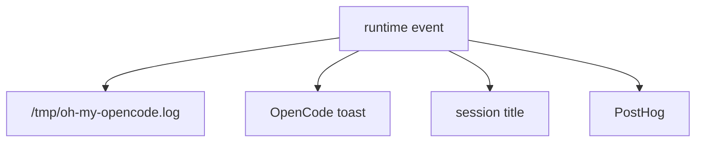

# 23장: 로그, toast, telemetry, 관찰성

오마오는 많은 일을 자동으로 한다. 자동화가 많을수록 관찰성이 중요하다. 로그, toast, telemetry, session title, doctor output은 모두 사용자가 시스템 상태를 이해하도록 돕는 장치다.

## 왜 중요한가

플러그인 실패는 조용히 지나가면 더 위험하다. 설정이 일부만 로드됐거나, fallback이 적용됐거나, 외부 plugin 충돌이 감지됐거나, background agent가 끝났다면 사용자는 알아야 한다. 하지만 모든 것을 채팅에 쓰면 방해가 된다.

## 소스 앵커

- `src/shared/logger.ts`
- `src/hooks/session-notification/`
- `src/hooks/background-notification/`
- `src/hooks/auto-update-checker/`
- `src/shared/posthog`

## 관찰성 표면



## 핵심 메커니즘

logger는 `/tmp/oh-my-opencode.log`에 쓴다. 이는 플러그인 로딩이나 config handler처럼 채팅 표면에 나오기 어려운 문제를 추적하는 기본 경로다.

toast는 사용자에게 즉시 알려야 하는 상태에 쓰인다. model fallback, update checker, notification hook은 OpenCode client의 TUI toast를 사용한다. toast는 log보다 가깝고, 채팅 메시지보다 덜 침습적이다.

PostHog telemetry는 plugin_loaded 같은 이벤트를 캡처한다. 실패해도 치명적이지 않게 감싼다. 관찰성 자체가 플러그인 동작을 막아서는 안 되기 때문이다.

CLI run과 doctor도 관찰성 표면이다. `run`은 event stream을 가공해 사용자에게 보여 주고, `doctor`는 설치와 모델 해상도 문제를 check result로 구조화한다.

## 트레이드오프

관찰성 표면이 많으면 중복 알림이 생길 수 있다. 그래서 오마오는 외부 notification plugin 충돌을 감지하고, force_enable 같은 설정을 둔다.

## 핵심 코드

`src/cli/doctor/runner.ts`는 진단을 구조화하고 timeout을 실패로 바꾼다.

```ts
export async function runDoctor(options: DoctorOptions): Promise<DoctorResult> {
  const start = performance.now()
  const allChecks = getAllCheckDefinitions()

  const checksPromise = Promise.all([
    Promise.all(allChecks.map(runCheck)),
    gatherSystemInfo(),
    gatherToolsSummary(),
  ])

  let timer: ReturnType<typeof setTimeout> | undefined
  const timeoutPromise = new Promise<never>((_, reject) => {
    timer = setTimeout(() => reject(new DoctorTimeoutError()), DOCTOR_TIMEOUT_MS)
  })

  let results: CheckResult[]
  let systemInfo: Awaited<ReturnType<typeof gatherSystemInfo>>
  let tools: Awaited<ReturnType<typeof gatherToolsSummary>>

  try {
    ;[results, systemInfo, tools] =
      await Promise.race([checksPromise, timeoutPromise])
  } catch (error) {
    clearTimeout(timer)
    if (error instanceof DoctorTimeoutError) {
      return buildTimeoutResult(start, options)
    }
    throw error
  }

  const summary = calculateSummary(results, performance.now() - start)
  const exitCode = determineExitCode(results)
  return { results, systemInfo, tools, summary, exitCode }
}
```

## 소스 그라운딩

- `src/shared/logger.ts`의 `log()`는 플러그인 내부 상태를 파일 로그로 남긴다. config handler, background manager, event fallback 모두 이 log를 사용한다.
- `createSessionHooks()`는 `detectExternalNotificationPlugin(ctx.directory)`로 외부 notification plugin을 감지하고, `notification.force_enable`이 아니면 session notification hook 생성을 건너뛸 수 있다.
- `TaskToastManager`는 `initTaskToastManager(ctx.client)`로 초기화되고, background task queue/running 상태를 toast surface에 반영한다.
- `run()` CLI는 PostHog에 `run_started`, `run_completed`, `run_failed`를 캡처하지만 실패는 non-fatal catch로 무시한다.
- `doctor`는 check result를 `pass`, `fail`, `warn`, `skip`으로 계산하고 exit code는 fail이 하나라도 있으면 failure다.
- `tool-execute-after`는 native metadata와 stored metadata를 조합해 session linkage를 복원한다. 관찰성은 사용자가 보는 출력뿐 아니라 tool metadata에도 있다.

## 빌더에게 남는 것

자동화 플러그인은 실패를 숨기지 말아야 한다. log, toast, title, telemetry, doctor output 각각의 용도를 분리하면 사용자는 필요한 수준에서 상태를 볼 수 있다.
