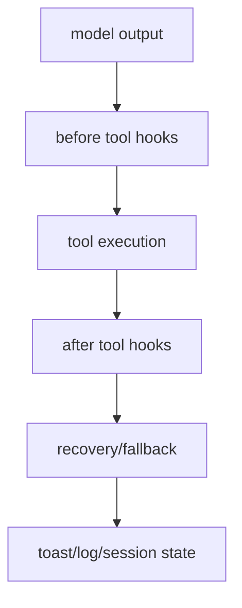

# 제5부: 위험한 실행을 어떻게 통제 가능한 UX로 바꾸는가

플러그인은 모델을 더 똑똑하게 만드는 곳만이 아니다. 실패를 발견하고, 위험한 실행을 막고, 긴 작업을 세션 바깥에서 관리하고, 사용자가 복구 경로를 볼 수 있게 만드는 곳이기도 하다. 오마오에서 훅의 상당수는 바로 이 문제를 맡는다.

이 부는 guardrail을 단순 금지 규칙이 아니라 UX와 상태 모델로 읽는다. 파일 수정은 Hashline으로 보호하고, background agent는 tmux와 manager로 격리하며, 모델 실패는 proactive fallback과 reactive runtime fallback으로 나눈다.

## 핵심 소스

- `src/plugin/hooks/create-*-hooks.ts`
- `src/hooks/`
- `src/tools/hashline-edit/`
- `src/features/background-agent/`
- `src/features/tmux-subagent/`
- `src/hooks/model-fallback/`
- `src/hooks/runtime-fallback/`
