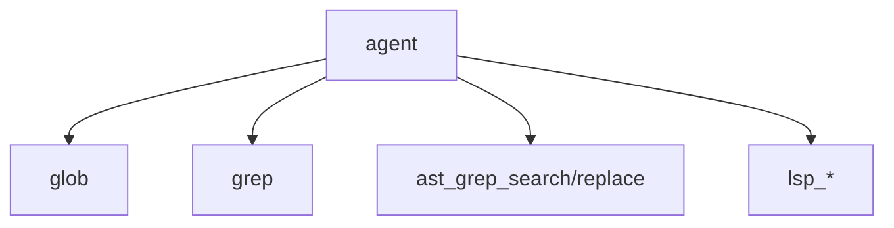

# 24장: LSP와 AST grep 코드 인텔리전스

오마오는 코드 탐색과 수정을 단순 grep에 맡기지 않는다. LSP 도구와 AST grep 도구를 함께 제공해 symbol, definition, reference, diagnostics, structural search를 모델에게 노출한다.

## 왜 중요한가

코딩 에이전트가 파일을 잘 고치려면 코드 구조를 읽을 수 있어야 한다. 텍스트 검색은 빠르지만 의미를 모른다. LSP는 의미를 알지만 환경 의존성이 있다. AST grep은 구조 패턴을 찾지만 언어별 parsing 비용이 있다. 오마오는 이들을 별도 도구로 나눠 선택 가능하게 한다.

## 소스 앵커

- `src/tools/lsp/`
- `src/tools/ast-grep/`
- `src/tools/grep/`
- `src/tools/glob/`
- `src/tools/index.ts`
- `src/tools/shared/`

## 도구 층



## 핵심 메커니즘

LSP 도구는 goto definition, find references, symbols, diagnostics, prepare rename, rename을 제공한다. 이 도구들은 코드베이스 의미를 직접 묻는 표면이다.

AST grep 도구는 구조 검색과 교체를 담당한다. 단순 문자열보다 안전하게 패턴을 찾고 바꿀 수 있다. 특히 대규모 refactor에서 의미 있는 중간 계층이 된다.

grep과 glob은 여전히 필요하다. 빠른 파일 탐색과 텍스트 검색은 더 무거운 의미 도구를 쓰기 전의 기본 단계다. 오마오는 세 계층을 경쟁시키지 않고 선택지로 둔다.

## 트레이드오프

의미 도구는 강력하지만 실패 원인도 다양하다. LSP server가 준비되지 않았거나, AST parser가 언어를 지원하지 않거나, 검색 범위가 너무 클 수 있다. 그래서 도구별로 작은 factory와 formatter를 유지한다.

## 핵심 코드

`src/tools/index.ts`에서 LSP 도구는 built-in tool로 바로 노출된다.

```ts
import {
  lsp_goto_definition,
  lsp_find_references,
  lsp_symbols,
  lsp_diagnostics,
  lsp_prepare_rename,
  lsp_rename,
  lspManager,
} from "./lsp"

export { lspManager }

export const builtinTools: Record<string, ToolDefinition> = {
  lsp_goto_definition,
  lsp_find_references,
  lsp_symbols,
  lsp_diagnostics,
  lsp_prepare_rename,
  lsp_rename,
}
```

## 소스 그라운딩

- `src/tools/index.ts`의 `builtinTools`는 `lsp_goto_definition`, `lsp_find_references`, `lsp_symbols`, `lsp_diagnostics`, `lsp_prepare_rename`, `lsp_rename`을 기본 제공한다.
- `createAstGrepTools(ctx)`, `createGrepTools(ctx)`, `createGlobTools(ctx)`는 tool registry에서 별도로 합쳐진다. 텍스트 검색, 구조 검색, 의미 검색이 분리된 factory를 가진다.
- `glob` 도구는 `rg --files` 기반 구현과 fallback을 가진다. `src/tools/glob/constants.ts`에는 timeout, limit, max depth, max output bytes가 상수로 분리되어 있다.
- `applyToolConfig()`는 `LspHover`, `LspCodeActions`, `LspCodeActionResolve`를 false로 둔다. 오마오가 노출하는 LSP 표면은 제한된 subset이다.
- `lspManager.cleanupTempDirectoryClients()`는 `session.deleted` cleanup 경로에서 호출된다. 코드 인텔리전스 도구도 세션 생명주기에 묶여 있다.

## 빌더에게 남는 것

코드 인텔리전스는 하나의 도구로 끝나지 않는다. 파일 발견, 텍스트 검색, 구조 검색, 의미 검색을 계층화해야 모델이 비용과 정확도 사이를 선택할 수 있다.
