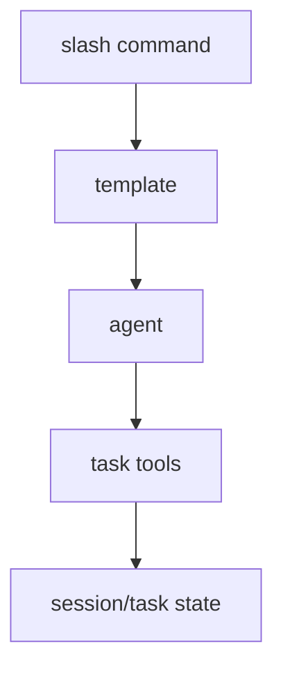

# 25장: 명령, task system, workflow 템플릿

오마오는 slash command와 task system을 통해 반복 workflow를 제품화한다. `start-work`, `handoff`, `refactor`, `remove-ai-slops`, `ralph-loop` 같은 템플릿은 단순 prompt 조각이 아니라 팀의 작업 절차를 모델에게 제공하는 방식이다.

## 왜 중요한가

사용자는 같은 작업을 반복한다. 매번 긴 지시문을 쓰게 하면 품질이 흔들린다. 명령과 task system은 반복 작업을 이름 붙은 workflow로 바꾼다.

## 소스 앵커

- `src/features/builtin-commands/`
- `src/features/builtin-commands/templates/`
- `src/features/claude-code-command-loader/`
- `src/tools/task/`
- `src/config/schema/commands.ts`
- `src/config/schema/start-work.ts`

## workflow 흐름



## 핵심 메커니즘

built-in command는 template으로 관리된다. command handler는 설정에 따라 disabled command를 제외하고 OpenCode command config에 합친다. Claude Code command loader도 비슷한 표면으로 들어온다.

새 task system이 켜지면 `task_create`, `task_get`, `task_list`, `task_update`가 tool registry에 추가된다. 동시에 legacy `task` delegate tool과 구분해야 한다. task system은 모델이 작업 상태를 명시적으로 다루게 만드는 장치다.

`start_work` 설정은 auto commit 같은 workflow 정책을 가진다. Atlas hook과도 연결되어 작업 시작과 추적을 이어 준다.

## 트레이드오프

명령은 반복성을 높이지만 너무 많으면 메뉴가 복잡해진다. task system은 상태를 명확히 하지만 모델에게 더 많은 절차를 요구한다. 오마오는 disabled command와 feature flag로 이 부담을 조절한다.

## 핵심 코드

`src/plugin/tool-execute-before.ts`는 slash command를 단순 텍스트가 아니라 continuation state 변경으로 처리한다.

```ts
if (input.tool === "skill") {
  const rawName = typeof output.args.name === "string"
    ? output.args.name
    : undefined
  const command = rawName?.replace(/^\//, "").toLowerCase()
  const sessionID = input.sessionID || getMainSessionID()

  if (command === "stop-continuation" && sessionID) {
    hooks.stopContinuationGuard?.stop(sessionID)
    hooks.todoContinuationEnforcer?.cancelAllCountdowns()
    hooks.ralphLoop?.cancelLoop(sessionID)
    clearBoulderState(ctx.directory)
  }

  const workStartingCommands = ["start-work", "ralph-loop", "ulw-loop"]
  if (workStartingCommands.includes(command ?? "") && sessionID) {
    if (hooks.stopContinuationGuard?.isStopped(sessionID)) {
      hooks.stopContinuationGuard.clear(sessionID)
    }
  }
}
```

## 소스 그라운딩

- `BuiltinCommandNameSchema`는 `init-deep`, `ralph-loop`, `ulw-loop`, `cancel-ralph`, `refactor`, `start-work`, `stop-continuation`, `remove-ai-slops`를 정의한다.
- `createSkillTool()`은 skill 이름뿐 아니라 slash command 이름도 처리한다. 명령은 `skill` tool의 같은 entry point로 호출될 수 있다.
- `createToolExecuteBeforeHandler()`는 `skill` tool에서 `ralph-loop`, `ulw-loop`, `cancel-ralph`, `stop-continuation`, `start-work` 명령을 감지해 hook state를 직접 조작한다.
- `stop-continuation`은 `stopContinuationGuard.stop()`, `todoContinuationEnforcer.cancelAllCountdowns()`, `ralphLoop.cancelLoop()`, `clearBoulderState()`를 한 번에 호출한다.
- `task` tool 호출 전 category가 있으면 `subagent_type`을 `sisyphus-junior`로 보정한다. 기존 task resume이면 `resolveSessionAgent()`로 이어받을 agent를 찾는다.
- task system이 켜졌는지는 `isTaskSystemEnabled(pluginConfig)`가 판단하고, tool registry와 tool config handler가 모두 이 값을 참조한다.

## 빌더에게 남는 것

반복 prompt를 문서에만 두지 말고 명령으로 승격할 수 있는지 보라. 다만 명령이 상태를 만들기 시작하면 task 도구와 recovery까지 함께 설계해야 한다.
