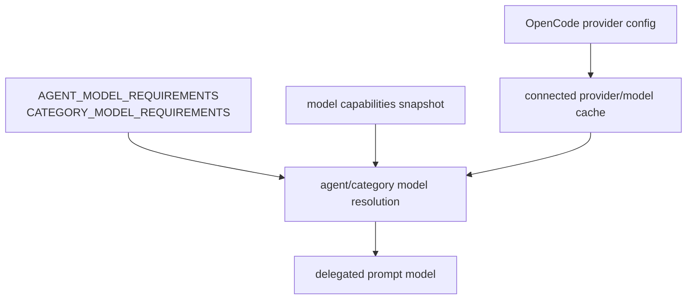

# 26장: 모델 capability와 provider 데이터

오마오는 모델 이름을 문자열로만 다루지 않는다. agent별 fallback chain, category별 model requirement, provider cache, models.dev 기반 capability snapshot, CLI refresh 경로가 함께 움직인다.

## 왜 중요한가

에이전트 오케스트레이션은 결국 모델 선택 문제와 맞닿는다. Sisyphus, Hephaestus, Prometheus, Atlas가 같은 모델을 쓰지 않는 이유가 있어야 하고, category 위임도 "어떤 모델이 적합한가"를 설명할 수 있어야 한다. 모델 목록은 시간에 따라 바뀌므로 코드 상수와 runtime cache를 같이 봐야 한다.

## 소스 앵커

- `src/shared/model-requirements.ts`
- `src/shared/model-capabilities/`
- `src/generated/model-capabilities.generated.json`
- `src/cli/refresh-model-capabilities.ts`
- `src/cli/provider-model-id-transform.ts`
- `src/cli/provider-availability.ts`
- `src/tools/delegate-task/model-selection.ts`
- `src/plugin-handlers/provider-config-handler.ts`

## 데이터 흐름



## 핵심 메커니즘

`AGENT_MODEL_REQUIREMENTS`는 agent별 fallback chain을 정의한다. 예를 들어 Sisyphus는 Claude Opus, Kimi, GPT, GLM 계열을 순서대로 시도할 수 있고, Hephaestus는 GPT 계열 provider를 요구한다. 이것은 prompt 취향이 아니라 역할별 모델 정책이다.

`CATEGORY_MODEL_REQUIREMENTS`는 위임 category의 모델 선택을 별도로 다룬다. `visual-engineering`, `ultrabrain`, `deep`, `quick`, `writing` 같은 category는 서로 다른 fallback chain을 가진다. `delegate-task`는 이 정보를 `resolveModelForDelegateTask()`로 해석한다.

`resolveModelForDelegateTask()`는 우선순위가 분명하다. 사용자 지정 모델이 있으면 먼저 쓰고, user-configured category model은 validation을 우회해 존중한다. provider/model cache가 아직 없으면 첫 실행 상황으로 보고 OpenCode 기본 모델에 맡길 수 있다. cache가 있으면 fuzzy match와 provider hint를 사용한다.

`applyProviderConfig()`는 OpenCode provider config를 읽어 context limit cache와 vision capable model cache를 채운다. multimodal agent나 image input 판단은 이 cache에 의존한다.

`refresh-model-capabilities` CLI는 `loadPluginConfig()`로 source URL을 찾고 `refreshModelCapabilitiesCache()`를 호출한다. 모델 capability는 generated snapshot만이 아니라 갱신 가능한 데이터다.

## 트레이드오프

모델 정책을 코드에 두면 agent별 의도가 선명해진다. 대신 모델 시장이 바뀔 때 갱신 비용이 생긴다. 오마오는 generated snapshot, refresh CLI, provider cache, fallback chain을 함께 둬 이 비용을 분산한다.

## 핵심 코드

`src/shared/model-requirements.ts`의 fallback entry는 단순 문자열이 아니라 실행 파라미터를 가진다.

```ts
export type FallbackEntry = {
  providers: string[]
  model: string
  variant?: string
  reasoningEffort?: string
  temperature?: number
  top_p?: number
  maxTokens?: number
  thinking?: { type: "enabled" | "disabled"; budgetTokens?: number }
}

export type ModelRequirement = {
  fallbackChain: FallbackEntry[]
  variant?: string
  requiresModel?: string
  requiresAnyModel?: boolean
  requiresProvider?: string[]
}
```

`src/tools/delegate-task/model-selection.ts`는 category default, fallback chain, system default를 순서대로 해석한다.

```ts
const categoryDefault = normalizeModel(input.categoryDefaultModel)
if (categoryDefault) {
  if (input.isUserConfiguredCategoryModel) {
    const parsed = parseUserFallbackModel(categoryDefault)
    if (parsed?.variant) {
      return { model: parsed.baseModel, variant: parsed.variant }
    }
    return { model: categoryDefault }
  }

  const match = fuzzyMatchModel(
    categoryDefault,
    input.availableModels,
    providerHint,
  )
  if (match) {
    return { model: match }
  }
}

const fallbackChain = input.fallbackChain
if (fallbackChain && fallbackChain.length > 0) {
  for (const entry of fallbackChain) {
    for (const provider of entry.providers) {
      const fullModel = `${provider}/${entry.model}`
      const match = fuzzyMatchModel(fullModel, input.availableModels, [provider])
      if (match) {
        return { model: match, variant: entry.variant, fallbackEntry: entry }
      }
    }
  }
}
```

## 소스 그라운딩

- `FallbackEntry`는 `providers`, `model`, `variant`, `reasoningEffort`, `temperature`, `top_p`, `maxTokens`, `thinking`을 가질 수 있다. fallback은 단순 model name 목록이 아니다.
- `sisyphus` requirement는 `requiresAnyModel: true`를 사용한다. fallback chain 중 하나라도 사용 가능해야 agent를 활성화한다.
- `hephaestus` requirement는 `requiresProvider`로 OpenAI/GitHub Copilot/Venice/OpenCode/Vercel 계열 provider를 요구한다.
- category requirement 중 `artistry`는 `requiresModel: "gemini-3.1-pro"`를 가진다. 특정 category는 모델 capability를 강하게 요구할 수 있다.
- `transformModelForProvider()`는 provider별 모델 ID 변환을 담당한다. fallback chain의 logical model name이 provider API model ID와 항상 같지는 않다.
- `applyProviderConfig()`는 `modalities.input` 또는 `capabilities.input.image`를 보고 vision capable model cache를 채운다.
- `refreshModelCapabilities()`는 성공 시 `{ sourceUrl, generatedAt, modelCount }` summary를 출력한다. 실패하면 exit code 1을 반환한다.

## 빌더에게 남는 것

멀티 모델 플러그인은 "model string 하나"로 설계하면 오래 못 간다. agent requirement, category requirement, provider cache, capability refresh, provider별 model ID transform을 별도 계층으로 둬야 한다.
