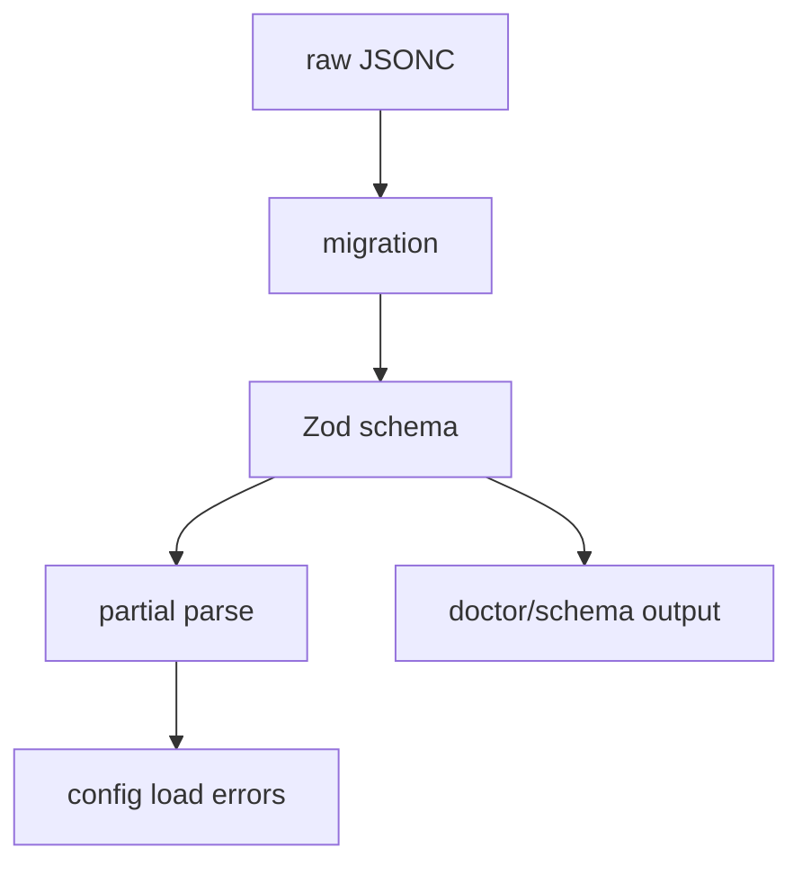

# 27장: 스키마, 마이그레이션, 설정 진단

오마오 설정은 19개 이상의 feature-specific config를 가진다. 이 정도 규모에서는 schema, migration, doctor가 없으면 설정이 곧 기술 부채가 된다.

## 왜 중요한가

플러그인은 사용자의 로컬 환경에서 실행된다. 잘못된 설정이 있어도 서버 운영자가 고칠 수 없다. 따라서 설정 파일은 스스로 검증되고, 가능한 경우 자동 migration되며, 실패 시 진단 가능해야 한다.

## 소스 앵커

- `src/config/schema/`
- `src/plugin-config.ts`
- `src/shared/migration/`
- `src/shared/migrate-legacy-config-file.ts`
- `src/cli/doctor/`
- `script/build-schema.ts`

## 설정 안정성 흐름



## 핵심 메커니즘

root schema는 `OhMyOpenCodeConfigSchema`다. agent definitions, disabled arrays, claude_code, skills, background task, runtime fallback, tmux, websearch 등 기능별 schema를 합친다.

migration은 idempotent해야 한다. `_migrations` 기록을 통해 같은 변환이 반복 적용되지 않게 하고, 파일 변경 전 backup을 만드는 구조를 둔다.

partial parsing은 운영 안정성을 높인다. 한 section이 잘못되어도 나머지 설정을 살릴 수 있다. doctor는 이런 상태를 사용자가 이해할 수 있는 출력으로 바꾸는 표면이다.

## 트레이드오프

schema가 세밀할수록 사용자 오류를 빨리 잡지만, 설정 변경 비용도 커진다. migration을 제공하면 호환성은 좋아지지만, 오래된 키의 의미를 계속 유지해야 한다.

## 핵심 코드

`src/config/schema/oh-my-opencode-config.ts`의 root schema는 플러그인의 설정 표면을 그대로 드러낸다.

```ts
export const OhMyOpenCodeConfigSchema = z.object({
  $schema: z.string().optional(),
  new_task_system_enabled: z.boolean().optional(),
  default_run_agent: z.string().optional(),
  agent_definitions: AgentDefinitionsConfigSchema,
  disabled_mcps: z.array(AnyMcpNameSchema).optional(),
  disabled_agents: z.array(z.string()).optional(),
  disabled_skills: z.array(BuiltinSkillNameSchema).optional(),
  disabled_hooks: z.array(z.string()).optional(),
  disabled_commands: z.array(BuiltinCommandNameSchema).optional(),
  disabled_tools: z.array(z.string()).optional(),
  mcp_env_allowlist: z.array(z.string()).optional(),
  hashline_edit: z.boolean().optional(),
  model_fallback: z.boolean().optional(),
  agents: AgentOverridesSchema.optional(),
  categories: CategoriesConfigSchema.optional(),
  claude_code: ClaudeCodeConfigSchema.optional(),
  skills: SkillsConfigSchema.optional(),
  runtime_fallback: z.union([z.boolean(), RuntimeFallbackConfigSchema]).optional(),
  background_task: BackgroundTaskConfigSchema.optional(),
  tmux: TmuxConfigSchema.optional(),
  start_work: StartWorkConfigSchema.optional(),
  _migrations: z.array(z.string()).optional(),
})
```

## 소스 그라운딩

- `OhMyOpenCodeConfigSchema`는 `$schema`, `new_task_system_enabled`, `default_run_agent`, `agent_definitions`, disabled arrays, `hashline_edit`, `model_fallback`, `agents`, `categories`, `claude_code`, `skills`, `runtime_fallback`, `background_task`, `tmux`, `start_work`, `_migrations` 등을 한 root object로 묶는다.
- `ExperimentalConfigSchema`에는 `preemptive_compaction`, `dynamic_context_pruning`, `task_system`, `plugin_load_timeout_ms`, `safe_hook_creation`, `disable_omo_env`, `max_tools` 같은 escape hatch가 들어 있다.
- `TmuxConfigSchema`는 `enabled`, `layout`, `main_pane_size`, `main_pane_min_width`, `agent_pane_min_width`, `isolation`을 가진다.
- `RalphLoopConfigSchema`는 `enabled`, `default_max_iterations`, `default_strategy`를 가진다. 반복 실행은 명령뿐 아니라 config schema에도 고정되어 있다.
- `GitMasterConfigSchema`는 `commit_footer`, `include_co_authored_by`, `git_env_prefix`를 default로 가진다. commit 관련 정책도 skill/prompt가 아니라 config로 내려와 있다.
- `runDoctor()`는 모든 check와 system/tool summary를 `Promise.race()`로 30초 timeout 안에 실행한다. 진단도 hang을 실패로 구조화한다.

## 빌더에게 남는 것

설정이 커지는 순간 schema는 문서가 아니라 실행 경로다. migration, partial parse, doctor, schema build를 함께 갖춰야 사용자의 로컬 환경에서 플러그인이 오래 살아남는다.
