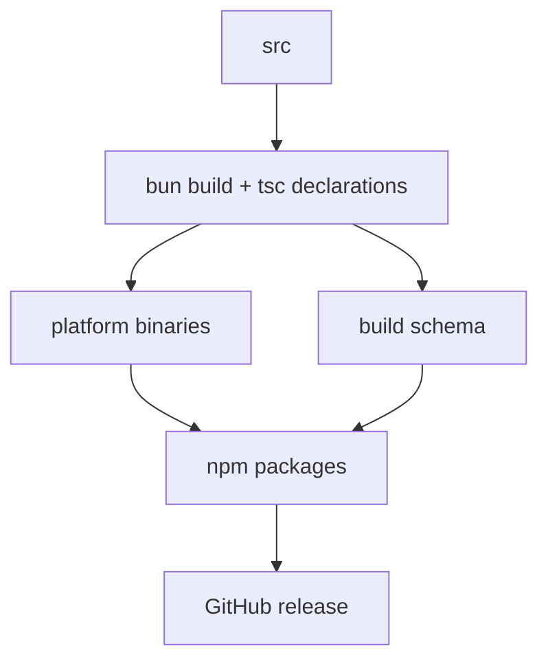

# 28장: 빌드, 바이너리, 배포 표면

오마오는 TypeScript 플러그인이지만 배포 표면은 npm 패키지와 플랫폼별 바이너리까지 포함한다. `oh-my-opencode`와 `oh-my-openagent`를 함께 제공하는 전환기도 고려해야 한다.

## 왜 중요한가

플러그인은 설치되어야만 가치가 있다. build가 복잡하거나 플랫폼별 실행이 불안정하면 기능이 아무리 좋아도 사용자는 첫 단계에서 실패한다. 오마오는 Bun 기반 build와 platform binary packaging을 함께 유지한다.

## 소스 앵커

- `package.json`
- `bin/`
- `postinstall.mjs`
- `script/build-binaries.ts`
- `script/build-schema.ts`
- `packages/`
- `.github/workflows/`

## 배포 흐름



## 핵심 메커니즘

`bun run build`는 plugin entry와 CLI entry를 ESM으로 빌드하고 declaration을 생성한 뒤 schema를 만든다. `@ast-grep/napi`와 `zod`는 external로 둔다.

`build:all`은 platform binaries까지 만든다. darwin, linux, windows와 AVX2, baseline 변형이 분리되어 있다. Windows는 별도 runner에서 빌드한다. cross compile보다 안정성을 택한 결정이다.

패키지는 `oh-my-opencode`와 `oh-my-openagent` 이름을 함께 다룬다. CLI bin도 두 이름을 노출한다. 전환기 호환성은 package.json, postinstall, plugin identity에 모두 영향을 준다.

## 트레이드오프

플랫폼별 바이너리는 설치 UX를 좋게 하지만 배포 파이프라인을 무겁게 한다. dual package는 migration을 돕지만 이름 혼란을 만든다. 오마오는 warning과 identity helper로 이 혼란을 줄인다.

## 핵심 코드

`src/cli/cli-program.ts`는 배포된 binary가 제공하는 실제 command surface다.

```ts
program
  .name("oh-my-opencode")
  .description("The ultimate OpenCode plugin - multi-model orchestration, LSP tools, and more")
  .version(VERSION, "-v, --version", "Show version number")
  .enablePositionalOptions()

program
  .command("install")
  .description("Install and configure oh-my-opencode with interactive setup")
  .option("--no-tui", "Run in non-interactive mode (requires all options)")
  .option("--claude <value>", "Claude subscription: no, yes, max20")
  .option("--openai <value>", "OpenAI/ChatGPT subscription: no, yes (default: no)")

program
  .command("run <message>")
  .allowUnknownOption()
  .passThroughOptions()
  .description("Run opencode with todo/background task completion enforcement")
  .option("-a, --agent <name>", "Agent to use")
  .option("-m, --model <provider/model>", "Model override")
  .option("--session-id <id>", "Resume existing session instead of creating new one")

program
  .command("doctor")
  .description("Check oh-my-opencode installation health and diagnose issues")
  .option("--status", "Show compact system dashboard")
  .option("--verbose", "Show detailed diagnostic information")
  .option("--json", "Output results in JSON format")

program.addCommand(createMcpOAuthCommand())
```

## 소스 그라운딩

- `package.json`의 `main`은 `./dist/index.js`, `types`는 `dist/index.d.ts`, bin은 `oh-my-opencode`와 `oh-my-openagent`를 같은 `bin/oh-my-opencode.js`에 연결한다.
- `exports`는 package root와 `./schema.json`만 노출한다. schema artifact는 `dist/oh-my-opencode.schema.json`이다.
- build script는 plugin entry, declaration, CLI entry, schema build를 한 명령에 묶는다. `@ast-grep/napi`와 `zod`는 external로 둔다.
- optionalDependencies에는 darwin, linux, windows, musl, baseline, AVX2 변형이 들어 있다. postinstall은 현재 플랫폼에 맞는 binary를 선택할 수 있다.
- `trustedDependencies`에 `@ast-grep/cli`, `@ast-grep/napi`, `@code-yeongyu/comment-checker`가 들어 있다. 설치 시 실행/네이티브 dependency 신뢰 경계를 명시한다.
- CI convention은 Bun 1.3.11과 `script/run-ci-tests.ts`의 mock-heavy test split이다. build 안정성은 test runner 구조에도 반영되어 있다.

## 빌더에게 남는 것

플러그인을 제품으로 배포한다면 build는 마지막 작업이 아니다. schema, declaration, CLI, postinstall, platform binary, release workflow가 모두 사용자 경험의 일부다.
