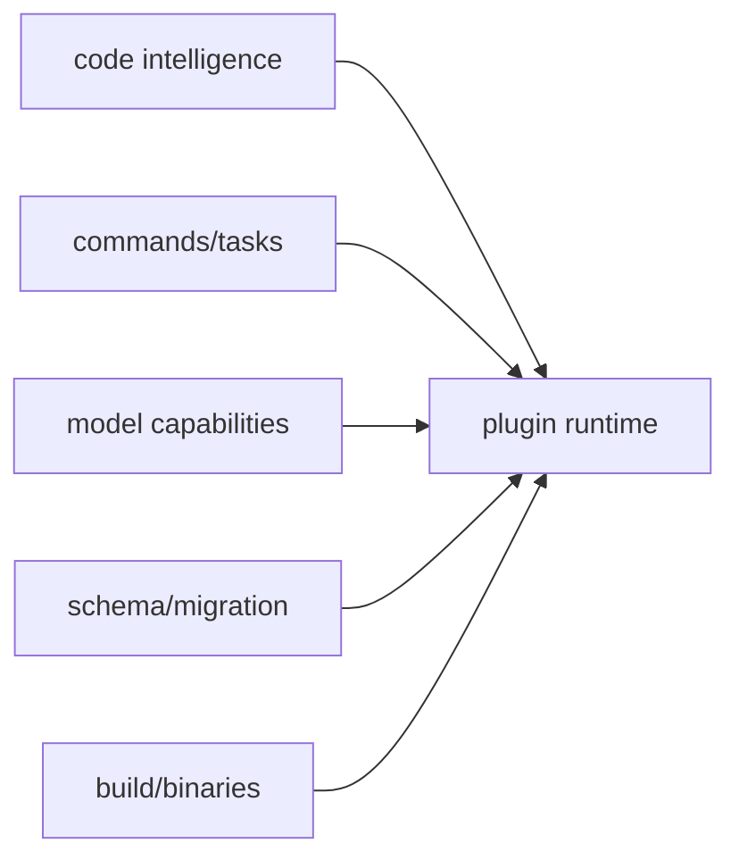

# 제6부: 복잡한 서브시스템을 어디에 가두는가

플러그인이 커지면 예외가 늘어난다. 코드 인텔리전스는 LSP와 AST grep을 필요로 하고, 명령은 템플릿과 discovery를 필요로 하며, 외부 알림은 Discord, Telegram, webhook, command dispatch를 필요로 한다. 설정은 Zod 스키마와 마이그레이션 없이는 오래 버티기 어렵고, 배포는 플랫폼별 바이너리까지 신경 써야 한다.

이 부는 오마오가 이런 복잡성을 어디에 격리했는지 본다. 중요한 것은 복잡성을 없애는 것이 아니라, 복잡성이 다른 계층으로 새지 않게 하는 것이다.

## 핵심 소스

- `src/tools/lsp/`
- `src/tools/ast-grep/`
- `src/features/builtin-commands/`
- `src/shared/model-capabilities/`
- `src/shared/model-requirements.ts`
- `src/config/schema/`
- `script/`
