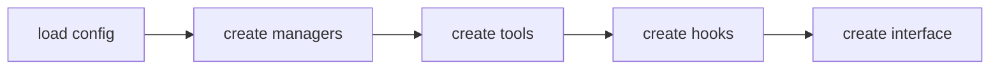

# 30장: 오마오 패턴으로 나만의 OpenCode 플러그인 설계하기

오마오를 청사진으로 삼는다는 것은 11개 에이전트와 52개 훅을 복사한다는 뜻이 아니다. 자기 플러그인에 필요한 경계와 순서를 먼저 정한다는 뜻이다.

## 1단계: entry point를 lifecycle로 만든다

`server(input)` 안에서 모든 로직을 구현하지 않는다. 아래 순서처럼 책임을 나눈다.



작은 플러그인도 이 순서를 따르면 커질 때 덜 흔들린다.

## 2단계: 설정 의미론을 먼저 정한다

어떤 필드는 override인지, 어떤 필드는 merge인지, 어떤 필드는 union인지 정한다. disabled list와 feature flag는 초기에 넣는 편이 낫다. 나중에 사용자가 끌 수 없는 기능은 운영 비용이 된다.

## 3단계: 확장 채널을 나눈다

에이전트는 행동 주체다. 도구는 실행 표면이다. 스킬은 지식 계층이다. MCP는 외부 protocol이다. 명령은 workflow template이다. 이 다섯 가지를 같은 "plugin feature"로 합치지 않는다.

## 4단계: 긴 작업을 prompt가 아니라 상태로 다룬다

하위 작업이 필요하면 background manager, output 조회, cancel, notification, recovery를 함께 설계한다. 장기 실행을 단순히 "계속해"라는 prompt로 해결하려 하면 실패를 추적할 수 없다.

## 5단계: guardrail을 hook tier에 맞춘다

파일 수정 보호는 tool-before 또는 tool-after에 둔다. 메시지 구조 검증은 transform에 둔다. 세션 오류 복구는 event 또는 runtime fallback에 둔다. 훅 위치가 곧 실패 처리 방식이다.

## 6단계: 호환성은 loader로 격리한다

다른 도구의 설정을 읽어야 한다면 core logic에 직접 섞지 않는다. loader, transformer, conflict detector, disable switch를 둔다. 호환성은 장점이지만 항상 부채도 만든다.

## 7단계: 관찰성을 기능과 함께 출시한다

log, toast, doctor, title 표시 중 무엇이 필요한지 정한다. 자동으로 복구하는 기능일수록 사용자가 볼 수 있는 흔적을 남겨야 한다.

## 최소 청사진

작은 OpenCode 플러그인을 만든다면 아래만으로 시작할 수 있다.

- `loadConfig`: JSONC와 schema validation
- `createManagers`: 오래 사는 상태와 cleanup
- `createTools`: tool registry와 disabled list
- `createHooks`: lifecycle별 hook factory
- `createPluginInterface`: OpenCode handler 연결
- `doctor`: 설치와 설정 실패 진단

## 소스 그라운딩 체크리스트

자기 플러그인을 설계할 때 오마오에서 가져갈 만한 실제 구현 체크리스트다.

- `src/index.ts`처럼 entry point는 조립 순서만 담는다.
- `src/plugin-config.ts`처럼 user/project config 병합 규칙을 필드별로 다르게 둔다.
- `src/create-managers.ts`처럼 오래 사는 상태는 manager로 승격하고 cleanup을 등록한다.
- `src/plugin/tool-registry.ts`처럼 tool registry는 factory 결과를 합치고 disabled/max cap을 마지막에 적용한다.
- `src/create-hooks.ts`처럼 hook은 lifecycle tier별 factory로 나눈다.
- `src/plugin-handlers/config-handler.ts`처럼 OpenCode config mutation은 단계형 pipeline으로 만든다.
- `src/tools/delegate-task/model-selection.ts`처럼 모델 선택은 user override, category default, fallback chain, system default를 순서대로 해석한다.
- `src/cli/doctor/runner.ts`처럼 진단도 timeout과 structured result를 가진 실행 경로로 만든다.

## 핵심 코드

최소 플러그인 골격은 오마오의 entry point를 줄인 형태로 시작할 수 있다.

```ts
const serverPlugin: Plugin = async (input): Promise<Hooks> => {
  const pluginConfig = loadPluginConfig(input.directory, input)
  const managers = createManagers({ ctx: input, pluginConfig })
  const tools = await createTools({ ctx: input, pluginConfig, managers })
  const hooks = createHooks({ ctx: input, pluginConfig, managers })

  return createPluginInterface({
    ctx: input,
    pluginConfig,
    managers,
    hooks,
    tools: tools.filteredTools,
  })
}

const pluginModule: PluginModule = {
  id: "my-opencode-plugin",
  server: serverPlugin,
}

export default pluginModule
```

이 코드는 실제 오마오 코드에서 `tmuxConfig`, `modelCacheState`, `firstMessageVariantGate`, `skill context`, `compaction`을 덜어낸 최소형이다. 작은 플러그인은 여기서 시작하고, 기능이 늘어날 때만 manager와 hook tier를 추가한다.

## 마지막 질문

플러그인은 코어보다 권한이 좁다. 하지만 그 제한 덕분에 좋은 설계 질문이 생긴다. "이 기능을 어디에 넣을 수 있는가"가 아니라 "이 기능은 어떤 계약으로 드러나야 하는가"를 묻는 순간, 플러그인은 기능 묶음이 아니라 운영 가능한 하니스가 된다.
