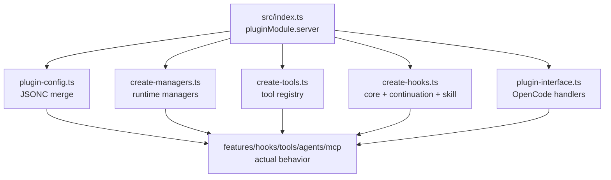

# 서문

이 책은 `oh-my-opencode`를 기능 목록으로 소개하려고 쓰인 책이 아니다. 기능 목록은 README나 릴리스 노트가 더 잘한다. 이 책이 붙드는 대상은 그보다 안쪽이다. 오마오가 OpenCode 플러그인 계약 위에서 어떻게 에이전트, 훅, 도구, MCP, Claude Code 호환성, 외부 알림, 모델 fallback을 하나의 운영 가능한 하니스로 묶는지를 보여 주려 한다.

OpenCode 책의 주어가 "코딩 에이전트 코어"였다면, 이 책의 주어는 "코어를 직접 소유하지 않는 확장 런타임"이다. 플러그인은 서버를 교체하지 않는다. 대신 `config`, `tool`, `chat.message`, `chat.params`, `event`, `tool.execute.before`, `tool.execute.after`, `experimental.chat.messages.transform`, `experimental.session.compacting` 같은 계약 지점에 개입한다. 이 제한이 오마오의 설계를 더 흥미롭게 만든다. 할 수 없는 일이 있기 때문에 경계가 선명해진다.

## 이 책이 증명하려는 것

이 책이 끝날 때 독자에게 남겨야 하는 문장은 하나다.

> 오마오는 OpenCode를 대체하는 앱이 아니라, OpenCode를 팀 단위 에이전트 운영 환경으로 확장하는 플러그인 하니스다.

이 주장을 성립시키려면 각 장은 아래 질문 중 하나에 답해야 한다.

1. 플러그인 계약 안에서 어떤 책임을 가져올 수 있는가
2. 사용자 설정을 어떻게 안전한 런타임 정책으로 바꾸는가
3. 에이전트와 도구를 어떻게 과하지 않게 늘리는가
4. 실패와 장기 실행을 어떻게 세션 바깥 상태로 관리하는가
5. Claude Code 호환성과 OpenCode 네이티브 기능을 어떻게 충돌 없이 합치는가

## 이 책의 판정 기준

이 책은 오마오를 아래 기준으로 평가한다.

- 기능이 많으냐보다, 플러그인 경계가 선명하냐
- 에이전트가 많으냐보다, 위임 계약과 모델 해상도가 설명 가능하냐
- 훅이 많으냐보다, 각 훅이 어느 생명주기 단계의 문제를 맡는지 분리되어 있느냐
- Claude Code 호환성이 넓으냐보다, OpenCode 네이티브 상태와 충돌하지 않느냐
- fallback이 공격적이냐보다, 사용자가 복구 경로를 이해할 수 있느냐

## 책의 읽기 계약

각 장은 거의 같은 리듬으로 구성된다.

1. 포지셔닝: 이 장이 다루는 플러그인 설계 문제를 먼저 고정한다.
2. 왜 중요한가: 기능 설명보다 실패 비용과 운영 비용으로 문제를 설명한다.
3. 소스 앵커: 다시 열어 볼 파일과 타입을 지정한다.
4. 흐름도: 제어 흐름이나 데이터 흐름을 먼저 시각화한다.
5. 핵심 메커니즘: 함수, 매니저, 훅, 스키마 단위로 해부한다.
6. 트레이드오프: 무엇이 쉬워지고 무엇이 비싸졌는지 적는다.
7. 빌더에게 남는 것: 자기 플러그인으로 옮길 수 있는 패턴만 남긴다.

## 코드와 문서를 왕복하는 이유

오마오는 `src/index.ts`에서 시작하지만, 진짜 구조는 그 파일 하나에 있지 않다. 초기화 순서는 `create-managers.ts`, `create-tools.ts`, `create-hooks.ts`, `plugin-interface.ts`, `plugin-config.ts`를 지나며 완성된다. OpenCode와의 계약은 `src/plugin/` 아래 핸들러로 드러나고, 실제 사용자 가치는 `src/agents`, `src/tools`, `src/hooks`, `src/features`, `src/mcp`에 흩어져 있다.

## 일곱 개의 부는 무엇을 묻는가

- 제1부는 오마오가 OpenCode 코어 위에 어디까지 올라서는지 묻는다.
- 제2부는 설정, 에이전트, 문맥, continuation이 어떻게 런타임 정책이 되는지 묻는다.
- 제3부는 OpenCode hook handler 하나하나가 어떤 제품 표면인지 묻는다.
- 제4부는 에이전트, 스킬, MCP, Claude Code 호환성을 왜 다른 계약으로 다루는지 묻는다.
- 제5부는 위험한 실행과 실패를 어떤 guardrail과 복구 UX로 바꾸는지 묻는다.
- 제6부는 복잡한 예외를 어느 서브시스템에 격리했는지 묻는다.
- 제7부는 자기 플러그인을 만들 때 무엇을 가져가고 무엇을 버릴지 묻는다.

## 추천 독서 경로

하니스 구조를 빨리 잡으려면 `1장 -> 2장 -> 3장 -> 4장 -> 10장 -> 19장 -> 29장`을 읽는다.

에이전트 운영을 설계하려면 `5장 -> 6장 -> 7장 -> 8장 -> 9장 -> 21장 -> 22장 -> 30장`을 읽는다.

Claude Code 호환성과 확장 생태계를 보려면 `14장 -> 16장 -> 17장 -> 18장 -> 25장 -> 27장`을 읽는다.

운영성과 배포를 보려면 `13장 -> 21장 -> 22장 -> 23장 -> 26장 -> 28장`을 읽는다.

## 끝까지 반복할 질문

- 이 책임은 OpenCode 코어가 아니라 플러그인이 가져야 하는가
- 이 상태는 메시지 텍스트 안에 둬도 되는가, 아니면 매니저나 스키마로 승격해야 하는가
- 이 기능은 에이전트, 도구, 훅, MCP, 명령 중 어느 계약이 가장 자연스러운가
- 실패했을 때 사용자가 보는 표면은 toast인가, 세션 이벤트인가, 자동 retry인가
- Claude Code 호환성을 더하는 동안 OpenCode 네이티브 기능을 가리지 않는가

기능은 쉽게 늘릴 수 있다. 하지만 플러그인 경계 안에서 기능을 운영 가능한 상태 모델로 남기는 일은 어렵다. 이 책은 그 어려운 쪽을 읽는다.
